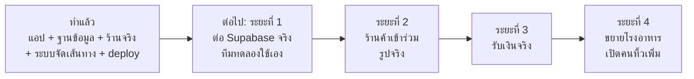

# แผนงาน Goose Man (ห่านบางมด)

> ไฟล์นี้ตอบ 3 คำถาม: **ทำอะไรไปแล้ว**, **อัปเดตอะไรล่าสุด** และ **จะทำอะไรต่อ**
> ส่วนวิธีการทำงานของระบบ (โค้ดอยู่ไหน รันยังไง) อยู่ใน [`PROJECT_GUIDE.md`](PROJECT_GUIDE.md)
>
> **อัปเดตล่าสุด:** 25 กันยายน 2569 · commit ล่าสุดตอนเขียน: `6cd3474`
>
> **วิธีใช้:** ทำงานไหนเสร็จ ให้ย้ายจากส่วน C ไปส่วน A และเพิ่มบรรทัดในส่วน B ใน commit เดียวกับงานนั้น
> ตัดสินใจเรื่องไหนแล้ว ให้ย้ายจากส่วน D ไปตารางการตัดสินใจ (A.9)

---

## สรุปสั้น: ตอนนี้อยู่ตรงไหน

- **แอปครบทั้งฝั่งผู้สั่ง ร้านค้า และคนหิ้ว** ใช้งานได้ในโหมดเดโม ทดสอบผ่านครบทุกชุด (unit 24, SQL 101, browser 69)
- **มีร้านจริงแล้ว** 12 ร้านของโรงอาหาร KFC (หลัก) 231 เมนู แต่รูปเมนูยังเป็น mockup
- **ฐานข้อมูลเขียนเสร็จและทดสอบแล้ว** แต่ **ยังไม่ได้สร้าง Supabase project จริง** จึงยังไม่มีใครสั่งของจริงได้
- **คนหิ้ว:** หน้าจอพร้อม แต่ปิดทางเข้าไว้จนกว่าจะมีขั้นตอน verify คนหิ้ว
- **ก้าวต่อไปที่สำคัญที่สุด:** ต่อฐานข้อมูลจริง แล้วให้ทีมทดลองสั่งและหิ้วกันเองในโรงอาหาร KFC (ระยะที่ 1 ในส่วน C)

---

## ส่วน A: ทำอะไรไปแล้ว

เรียงตามลำดับงานจริง (อ้างอิงรหัส commit ใน git)

### A.1 ตั้งต้นโปรเจกต์ และเปลี่ยนชื่อเป็น Goose Man · 23 ก.ย. 69

| commit | งาน |
|---|---|
| `275a6f6` | โค้ดตั้งต้น: แอป SvelteKit + backend Go/Fiber + Postgres (docker-compose) |
| `61d7544` | เปลี่ยนชื่อจาก Mod Man เป็น **Goose Man (ห่านบางมด)** |
| `792bf6c` | commit แรกบน repo ใหม่ |

### A.2 สร้างแอปฝั่งผู้สั่งใหม่ทั้งหมด และออกแบบตาม mockup · 23 ก.ย. 69

commit `d2b656e`

- สร้างหน้าจอหลัก 11 หน้าตามสเปก: login, หน้าแรก, รายชื่อร้าน, หน้าร้าน, ฝากซื้อ, สรุปคำสั่งซื้อ, จ่ายเงิน, ติดตาม, แชท, ส่งสำเร็จ, ประวัติ, โปรไฟล์
- เปลี่ยน state ทั้งหมดเป็น Svelte 5 runes (auth, cart, orders, checkout, nav)
- ออกแบบใหม่ตาม UX mockup `picture/Mod_Pass_Pase-1.png`: พื้นเรียบ, ชุดไอคอนเส้น, แถบหัว/แถบล่าง/เมนูล่างแบบเดียวกันทั้งแอป, หน้า PromptPay เต็มจอแทนป๊อปอัป
- ลดความเป็น "งาน AI" (ลดอีโมจิ, gradient, ลวดลายทั่วไป)
- ใส่ความรู้สึกดีตอนใช้ (delight): ห่านเดินตามเส้นทางในหน้าติดตาม, ของบินเข้าตะกร้า, มือถือสั่น, ตัวเลขยอดรวมเลื่อน, OTP เต็มจอ, ห่านในหน้าว่าง
- ปรับหน้าแรกที่เคยโล่งและหัวหน้าจอดูแยกกัน: รวมแถบหัวกับตำแหน่ง, ช่องค้นหา, ปุ่มสั่งซ้ำ, เพิ่มส่วนจุดรับ/จุดส่ง/ดีล

### A.3 ย้าย backend ไป Supabase, ร้าน Partner, login และข้อมูลผู้ใช้ · 24 ก.ย. 69

commit `7747da6`

- **เลิกใช้ backend Go** ย้ายกฎทั้งหมดไป Supabase: ตาราง, สิทธิ์ (RLS), ฟังก์ชันสั่งอาหารที่คิดราคาฝั่งเซิร์ฟเวอร์, Realtime, Storage, ข้อมูลตั้งต้น
- แอปรันด้วยข้อมูลเดโมได้เองถ้ายังไม่ใส่ key
- **ร้าน Partner:** แบนเนอร์หน้าร้าน, Fast lane, โปรของร้าน, โปรร่วมที่ต้องให้ Goose Man อนุมัติ, หน้า "จัดการร้านของฉัน" (แอปเดียวกัน แยกตามสิทธิ์)
- **Login + กรอกข้อมูลครั้งแรก:** ตรวจเบอร์ รหัสนักศึกษา, ยอมรับเงื่อนไขตาม PDPA, หน้าแก้ไขข้อมูล, หน้าเงื่อนไข/นโยบาย
- ใส่แบนเนอร์จริง และห่านเดินแบบสลับเฟรมจากภาพวาดจริง
- ปุ่ม "ฝากหิ้วเลย" ในหน้าแรกพาไปรายชื่อร้าน (เดิมไปหน้าฝากซื้อ)

### A.4 ระบบจัดเส้นทางคนหิ้ว และ benchmark · 24 ก.ย. 69

| commit | งาน |
|---|---|
| `49c6489` | พอร์ตตัวแก้ปัญหาเส้นทาง (OR-Tools PDPTW) จากโปรเจกต์ route optimize เดิมเป็น TypeScript: จัดลำดับรับ-ส่งแบบหาคำตอบดีที่สุด, แนะนำงานทางเดียวกัน · เพิ่ม unit test |
| `30d7ea9` | benchmark วัดความเร็ว + เทียบคุณภาพเส้นทางกับ OR-Tools + notebook สำหรับ Google Colab |

**ผลที่ได้ (รันบน Colab):** เส้นทางดีเท่า OR-Tools ทุกโจทย์ (ต่าง 0.00%) และเร็วกว่ามาก (4 งาน 0.68 ms เทียบกับ OR-Tools ~1 วินาที) → **ตั้งความจุคนหิ้วไว้ 4 งานต่อรอบ** รายละเอียดใน `PROJECT_GUIDE.md` ข้อ 12.2

### A.5 โหมดคนหิ้ว · 24 ก.ย. 69

| commit | งาน |
|---|---|
| `56be223` | ฐานข้อมูล: รายชื่อคนหิ้ว `rider_roster` (ระยะแรกให้ทีมเราหิ้วเอง), ถือได้ 4 งานต่อรอบ, เริ่มส่งแล้วห้ามรับเพิ่ม, คืนงานได้, `rider_board()` |
| `cdc74d5` | หน้าจอคนหิ้ว: บอร์ดงาน, รอบที่ถือเรียงตามเส้นทางที่ระบบจัด (พร้อมเวลารออาหาร), แนะนำงานทางเดียวกันสูงสุด 3 งาน, รับของ, คืนงาน, ยืนยัน OTP · ผู้สั่งได้แจ้งเตือนเมื่อคนหิ้วคืนงาน |

### A.6 Deploy และเอกสาร · 24-25 ก.ย. 69

| commit | งาน |
|---|---|
| `62736c2` | แก้เอกสารเก่าให้ตรงกับระบบ Supabase |
| `7c5f3fd` | deploy ขึ้น GitHub Pages อัตโนมัติทุกครั้งที่ push เข้า `main` (ทดสอบ → build → deploy), รองรับโดเมนของตัวเอง |
| `6d78770` | รวมงาน deploy และเอกสารจาก branch `beta/claude/read-project-f41lis` |

### A.7 ร้านจริง, ขนาดเมนู, โลโก้ร้าน · 25 ก.ย. 69

| commit | งาน |
|---|---|
| `186524f` | ฐานข้อมูลรองรับโลโก้และรูปร้านที่ Partner ตั้งเอง (รูปต้องอยู่ในโฟลเดอร์ร้านตัวเองเท่านั้น), แสดงโลโก้หรือตัวอักษรแรกของชื่อร้าน |
| `3e78141` | **แทนร้านสมมติทั้งหมดด้วยร้านจริง 12 ร้าน** ของโรงอาหาร KFC (หลัก) จาก PDF · **เลือกธรรมดา/พิเศษในเมนูเดียว** (ฐานข้อมูลคิดราคาพิเศษเอง) · **รูปเมนู mockup** แทนตัวหนังสือ · รูปร้านจริงตัดจาก PDF · แก้บั๊กขนาดพิเศษหายตอนสั่ง · ย้าย test SQL และ browser เข้า repo |

### A.8 ปรับการใช้งานตามที่ทีมขอ และเอกสารทีม · 25 ก.ย. 69

| commit | งาน |
|---|---|
| `9e762fa` | ออกแบบหน้า login ใหม่ (เต็มจอ, ห่านยืน) |
| `7b9f450` | **login แล้วเข้าแอปได้เลย ขอข้อมูลตอนสั่งครั้งแรก** · ข้อมูลคงที่ผูกกับบัญชี ข้อมูลที่เปลี่ยนได้เลือกทุกออเดอร์ · ฐานข้อมูลไม่ให้สั่ง/รับงานถ้าข้อมูลไม่ครบ |
| `f5110b4` | **เอาปุ่มโหมดคนหิ้วออกจากหน้าโปรไฟล์** เพราะคนหิ้วต้องผ่านการ verify จากทีมก่อน |
| `6cd3474` | **คู่มือทีม `PROJECT_GUIDE.md`** แทนเอกสารส่งมอบเก่า |

### A.9 การตัดสินใจที่ทำไปแล้ว

เก็บไว้เพื่อไม่ต้องถกเรื่องเดิมซ้ำ ถ้าจะเปลี่ยน ให้แก้ตารางนี้ด้วย

| เรื่อง | ตัดสินใจว่า | เหตุผล |
|---|---|---|
| Backend | ใช้ Supabase ทั้งหมด เลิก Go | ไม่ต้องดูแลเซิร์ฟเวอร์เอง, มี login/realtime/storage ในตัว |
| แอปร้านค้า | แอปเดียวกับผู้สั่ง แยกตามสิทธิ์ | ดูแลโค้ดชุดเดียว |
| กฎสำคัญอยู่ที่ไหน | ในฐานข้อมูล (ราคา, สิทธิ์, สถานะ) | แก้โค้ดแอปแล้วโกงไม่ได้ |
| ร้านสมมติ | แทนด้วยร้านจริงทั้งหมด | ใช้ทดลองจริงได้ |
| KFC (หลัก) กับโรงชาย | เป็นคนละที่ | ตามข้อมูลจริง |
| ขนาดธรรมดา/พิเศษ | เลือกได้ในเมนูเดียว | ไม่ทำให้รายการเมนูยาวเป็นสองเท่า |
| รูปเมนู | ใช้ mockup ไปก่อน ไม่ใช้ตัวหนังสือล้วน | รอรูปจริงจากร้าน |
| ข้อมูลร้านที่ไม่มี | ไม่แต่ง (คะแนน, รีวิว, โปร, สถานะ Partner, เบอร์เจ้าของร้าน) | ความน่าเชื่อถือ และข้อมูลส่วนบุคคล |
| คนหิ้วระยะแรก | ทีมเราหิ้วเอง | เริ่มเล็ก ควบคุมคุณภาพได้ |
| คนหิ้ววิธีเข้าร่วม | ต้องผ่านการ verify จากทีม ไม่มีปุ่มสมัครเอง | ความปลอดภัยของผู้สั่ง |
| ความจุคนหิ้ว | 4 งานต่อรอบ | benchmark: คำนวณเร็ว ส่งทันเวลาเกือบทุกกรณี |
| ขอข้อมูลผู้ใช้เมื่อไร | ตอนสั่งครั้งแรก ไม่ใช่ตอน login | ให้ลองดูแอปก่อนได้ |
| ข้อมูลผู้ใช้ | คงที่ผูกกับบัญชี (ชื่อเล่น, เบอร์, คณะ, รหัส) · เลือกทุกออเดอร์ (จุดส่ง, หมายเหตุ, วิธีจ่าย) | ไม่ต้องกรอกซ้ำ |
| Benchmark หนัก | รันบน Google Colab | เครื่องในทีมบางเครื่อง RAM น้อย |
| Deploy | GitHub Pages อัตโนมัติจาก `main` | ฟรี ไม่ต้องดูแลเซิร์ฟเวอร์ |
| Git | push ทั้ง `origin` และ `beta`, commit งานที่เสร็จก่อนเริ่มงานใหม่ | ย้อนกลับได้ทีละเรื่อง |

---

## ส่วน B: การอัปเดตล่าสุด

ใหม่สุดอยู่บน

### 25 ก.ย. 69

**สิ่งที่ผู้ใช้เห็นเปลี่ยน**
- login แล้วเข้าหน้าแรกทันที ทักด้วยชื่อจาก Google ("สวัสดี กูส")
- สั่งครั้งแรกจะเจอฟอร์ม "ก่อนสั่งครั้งแรก" กรอกเสร็จกลับมาหน้าสรุปคำสั่งซื้อเดิม ตะกร้าไม่หาย
- หน้าสรุปคำสั่งซื้อมีการ์ดข้อมูลผู้สั่ง "ผูกกับบัญชี"
- ฟอร์มข้อมูลไม่ถามจุดส่งแล้ว (เลือกตอนสั่ง)
- ฝากซื้อ: ข้อความที่พิมพ์ไม่หายระหว่างไปกรอกข้อมูล
- หน้าโปรไฟล์ไม่มีปุ่มโหมดคนหิ้ว
- หน้า login ออกแบบใหม่
- ร้านจริง 12 ร้าน, รูปร้านจริง, รูปเมนู mockup, เลือกธรรมดา/พิเศษ
- ร้านที่ยังไม่มีรีวิวแสดง "ร้านใหม่ในแอป" แทนดาว
- จุดรับที่ยังไม่มีร้านในแอปขึ้นว่า "ฝากซื้อ"

**สิ่งที่เปลี่ยนเบื้องหลัง**
- migration ใหม่ 2 ไฟล์: `20260928000000_kfc_menu_sizes.sql`, `20260929000000_profile_at_first_order.sql`
- แก้บั๊ก: ขนาดพิเศษหายตอนสั่งในโหมดเดโม
- test SQL และ browser ย้ายเข้า repo (`frontend/tests/`) รันด้วย `npm run test:sql`, `npm run test:e2e`
- เอกสาร: `PROJECT_GUIDE.md` ใหม่, `PLAN.md` (ไฟล์นี้), ลบ `PROJECT_HANDOVER.md`, แก้ README ทุกไฟล์ให้ตรงกัน
- push ขึ้นทั้งสอง repo แล้ว

### 24 ก.ย. 69

- ย้ายไป Supabase, ร้าน Partner, login + ข้อมูลผู้ใช้ + PDPA
- ระบบจัดเส้นทาง + benchmark บน Colab
- โหมดคนหิ้ว (ตอนนั้นเข้าได้จากหน้าโปรไฟล์)
- deploy GitHub Pages

### 23 ก.ย. 69

- ตั้งต้นโปรเจกต์, เปลี่ยนชื่อเป็น Goose Man, สร้างแอปผู้สั่งใหม่ตาม mockup

---

## ส่วน C: จะทำอะไรต่อ

ขนาดงาน: **S** = ไม่เกินครึ่งวัน · **M** = 1-2 วัน · **L** = หลายวัน/ต้องประสานคนนอก
"ต้องการ" = สิ่งที่ต้องได้จากทีมหรือคนนอกก่อนเริ่มได้

### ระยะที่ 1: พร้อมให้ทีมทดลองใช้จริง (Pilot ภายในทีม)

**เป้าหมาย:** ทีมเราสั่งอาหารจากโรงอาหาร KFC (หลัก) และหิ้วส่งกันเองได้จริงผ่านแอปบนเว็บ ด้วยบัญชี มจธ. จริง

| # | งาน | รายละเอียด | ต้องการ | ขนาด | เสร็จเมื่อ |
|---|---|---|---|---|---|
| 1.1 | **สร้าง Supabase project** | สมัคร, สร้าง project (Singapore), รัน migration 6 ไฟล์ + seed ตามลำดับใน `supabase/README.md` | บัญชี Supabase ของทีม | S | ตารางและร้าน 12 ร้านขึ้นในฐานข้อมูล |
| 1.2 | **เปิด Google login** | สร้าง OAuth client ใน Google Cloud, ใส่ใน Supabase, ตั้ง Redirect URLs (localhost + เว็บจริง) | บัญชี Google Cloud | S | login ด้วยอีเมล มจธ. ได้ อีเมลอื่นถูกปฏิเสธ |
| 1.3 | **ใส่ key ในแอป** | `frontend/.env` สำหรับเครื่องพัฒนา และ GitHub Secrets `PUBLIC_SUPABASE_URL`, `PUBLIC_SUPABASE_ANON_KEY` สำหรับเว็บจริง (anon key เท่านั้น) | Project URL + anon key | S | เว็บบน GitHub Pages เป็นโหมดจริง |
| 1.4 | **ทดสอบโหมดจริงครบวงจร** | ลองสั่ง → รับงาน → รับของ → OTP → รีวิว ด้วยบัญชีจริง 2 คน, ลองฝากซื้อ, ลองยกเลิก, ลองแชทและส่งรูป, ลองบัญชีร้านที่เชิญ | 1.1-1.3, บัญชี มจธ. 2-3 บัญชี | M | ทุกขั้นทำงานบนเว็บจริง ไม่มี error |
| 1.5 | **ตัดสินใจเรื่องค่ากล่อง 5 บาท** แล้วทำ | ดูส่วน D ข้อ D1 | คำตอบจากทีม + ถามร้าน | S-M | ยอดในแอปตรงกับที่ร้านเก็บจริง |
| 1.6 | **ขั้นตอน verify คนหิ้ว** | กำหนดว่าตรวจอะไร (ดูส่วน D ข้อ D3), เขียนเป็นขั้นตอน, เพิ่มชื่อคนในทีมที่ผ่านใน `rider_roster` | ทีมตกลงเกณฑ์ | S | มีรายชื่อคนหิ้วชุดแรกในฐานข้อมูล |
| 1.7 | **ทางเข้าโหมดคนหิ้ว** สำหรับคนที่ verify แล้ว | ดูส่วน D ข้อ D2 · หน้าจอมีแล้ว แค่เพิ่มทางเข้า และเอา test คนหิ้วกลับมา (อยู่ใน git history ของ `frontend/tests/e2e.mjs` ก่อน commit `f5110b4`) | คำตอบ D2 | S | คนในรายชื่อเข้าได้ คนอื่นไม่เห็นทางเข้า |
| 1.8 | **เก็บพิกัดตึกจริง** | เดินเก็บพิกัดทางเข้า: โรงอาหาร KFC (หลัก) และจุดส่ง 8 จุด ใส่ใน `frontend/src/lib/routing/places.ts` ลบ `approximate` | คนเดินเก็บพิกัด | S | เส้นทางแนะนำสมเหตุสมผลเมื่อเดินจริง |
| 1.9 | **ตรวจเงื่อนไขและนโยบายความเป็นส่วนตัว** | อ่าน `frontend/src/lib/data/legal.ts` ให้ตรงกับการเก็บข้อมูลจริง (ข้อมูลอะไร เก็บนานแค่ไหน ใครเห็น ติดต่อใคร) ถ้าแก้ต้องเปลี่ยน `TERMS_VERSION` | คนรับผิดชอบเรื่อง PDPA ของทีม | S | ข้อความตรงกับที่ระบบทำจริง |
| 1.10 | **วิธีจ่ายเงินช่วงทดลอง** | ระหว่างยังไม่มี PromptPay จริง ให้ใช้เงินสดอย่างเดียว หรือซ่อนตัวเลือก PromptPay ในโหมดจริง | ทีมตกลง | S | ผู้ใช้ไม่เข้าใจผิดว่าจ่ายผ่าน QR จำลองได้ |
| 1.11 | **ทดลองใช้จริงช่วงเที่ยง** | ทีมสั่งและหิ้วจริง 1-2 สัปดาห์ จดปัญหา เวลาส่งจริง คิวจริงของแต่ละร้าน | 1.1-1.10 | L | มีบันทึกปัญหาและตัวเลขจริง ใช้ปรับระยะถัดไป |

**หลังทดลอง:** ปรับ "คิวโดยประมาณ" ของแต่ละร้านใน `data/stores.ts` ให้ตรงกับเวลาจริง และปรับค่าเดินเร็ว/ชั้นใน `routing/cost.ts` ถ้าคลาดเคลื่อน

### ระยะที่ 2: ร้านค้าเข้าร่วม

**เป้าหมาย:** ร้านใน KFC (หลัก) มาเป็น Partner ดูแลหน้าร้านเอง และแอปมีรูปอาหารจริง

| # | งาน | รายละเอียด | ต้องการ | ขนาด | เสร็จเมื่อ |
|---|---|---|---|---|---|
| 2.1 | **คุยกับร้าน** | อธิบาย Goose Man, ขออนุญาตใช้ชื่อและเมนู, ถามเรื่องค่ากล่อง, Fast lane, สนใจเป็น Partner ไหม | คนในทีมไปคุย | L | มีร้านตกลงเข้าร่วมอย่างน้อย 2-3 ร้าน |
| 2.2 | **รูปอาหารจริง** | ถ่ายรูปเมนูจริง (หรือขอจากร้าน), ใส่ `imageUrl` แทนรูป mockup ทีละเมนู | 2.1, คนถ่ายรูป | M-L | ร้านที่เข้าร่วมไม่มีรูป mockup เหลือ |
| 2.3 | **ปุ่มอัปโหลดโลโก้และรูปร้านในหน้า Partner** | ฐานข้อมูล, `catalog.updateStorefront` (`logoFile`, `photoFile`) และ `api/live.ts` รองรับแล้ว เหลือหน้าจอใน `PartnerScreen.svelte` + test | ไม่มี | S | Partner เปลี่ยนโลโก้/รูปร้านเองได้ |
| 2.4 | **เชิญร้านเป็น Partner** | `insert into partner_invites ...` ตาม `PROJECT_GUIDE.md` ข้อ 16.2 | 2.1, อีเมลเจ้าของร้าน | S | เจ้าของร้าน login แล้วเห็นหน้าจัดการร้าน |
| 2.5 | **ร้านเปิด/ปิดร้าน และปิดเมนูที่หมดเอง** | ตอนนี้ต้องให้ทีมแก้ในฐานข้อมูล ทำปุ่มในหน้า Partner + ฟังก์ชันในฐานข้อมูลที่ตรวจสิทธิ์ร้าน | ไม่มี | M | ร้านกดปิดร้าน/เมนูหมดได้เอง ผู้สั่งเห็นทันที |
| 2.6 | **ให้ร้านแก้เมนูและราคาเอง** (ถ้าร้านต้องการ) | ตอนนี้ทีมแก้ใน `stores.ts` + ฐานข้อมูล · ต้องออกแบบว่าแก้ราคาแล้วต้องอนุมัติไหม | ตัดสินใจ D5 | M-L | ร้านแก้เมนูได้โดยไม่ต้องผ่านทีม (หรือผ่านการอนุมัติ) |
| 2.7 | **แจ้งเตือนร้านเมื่อมีออเดอร์** (ถ้าร้านทำ Fast lane) | ร้านต้องรู้ว่ามีออเดอร์จากแอปเข้ามา | ตัดสินใจว่าร้านต้องเห็นออเดอร์หรือไม่ | M | ร้าน Fast lane เห็นออเดอร์ที่ต้องทำ |

### ระยะที่ 3: เงินจริง

**เป้าหมาย:** จ่ายผ่าน PromptPay ได้จริง และคนหิ้วได้ค่าหิ้วอย่างเป็นระบบ

| # | งาน | รายละเอียด | ต้องการ | ขนาด | เสร็จเมื่อ |
|---|---|---|---|---|---|
| 3.1 | **เลือกวิธีรับเงิน** | ผู้ให้บริการรับชำระ (payment gateway) ที่ออก PromptPay QR และแจ้งผลได้ หรือ PromptPay ของทีม + ตรวจสลิป | ตัดสินใจ D4, เอกสารธุรกิจ | L | ได้ผู้ให้บริการและเงื่อนไขค่าธรรมเนียม |
| 3.2 | **QR จริง + ยืนยันการจ่ายอัตโนมัติ** | แทน `MockQr` และการยืนยันจำลองใน `PaymentScreen.svelte` · การยืนยันต้องมาจากฝั่งเซิร์ฟเวอร์ (Supabase Edge Function รับ webhook) ไม่ใช่จากแอป | 3.1 | L | จ่ายจริงแล้วออเดอร์เข้าระบบเอง |
| 3.3 | **เงินพักจนส่งสำเร็จ และคืนเงินเมื่อยกเลิก** | ตามที่แอปบอกผู้ใช้ "เงินพักในระบบจนกว่าจะยืนยัน OTP" | 3.1-3.2 | L | ยกเลิกแล้วได้เงินคืน, ส่งสำเร็จแล้วร้าน/คนหิ้วได้เงิน |
| 3.4 | **สรุปรายได้คนหิ้ว** | ค่าหิ้ว + ทิปของแต่ละคน รายวัน/รายสัปดาห์ | 3.3 | M | คนหิ้วเห็นรายได้ ทีมจ่ายเงินได้ถูกต้อง |

### ระยะที่ 4: ขยาย

| # | งาน | รายละเอียด | ต้องการ | ขนาด |
|---|---|---|---|---|
| 4.1 | **เพิ่มโรงอาหารอื่น** | โรงชาย, Green Canteen 190 ปี (ขั้นตอนใน `PROJECT_GUIDE.md` ข้อ 16.7) | ข้อมูลร้านและเมนูจริง | M ต่อโรงอาหาร |
| 4.2 | **หน้า admin** | แทนการใช้ SQL Editor: จัดการคนหิ้ว, เชิญร้าน, อนุมัติโปรร่วม, ดูออเดอร์ที่มีปัญหา, ปลดล็อก OTP | ไม่มี | L |
| 4.3 | **แจ้งเตือนบนมือถือ (push)** | แจ้งผู้สั่งเมื่อคนหิ้วรับงาน/ใกล้ถึง, แจ้งคนหิ้วเมื่อมีงานใหม่ | ไม่มี | M-L |
| 4.4 | **จำนวนคนหิ้วที่ออนไลน์** | สถานะพร้อมรับงานของคนหิ้ว แล้วแสดงจำนวนในหน้าแรก (ตอนนี้ซ่อนในโหมดจริง) | ระยะที่ 1 เสร็จ | M |
| 4.5 | **แผนที่ในแอป** | แผนที่แคมปัสแสดงจุดรับ-ส่งและเส้นทางคนหิ้ว | พิกัดจริง (1.8) | M-L |
| 4.6 | **เส้นทางเดินจริง** | แทนการคิดระยะเส้นตรง × 1.3 ด้วยเส้นทางเดินจริงในแคมปัส (`travelSeconds` ใน `routing/cost.ts`) | ข้อมูลทางเดิน | L |
| 4.7 | **เปิดรับคนหิ้วเพิ่ม** | ยังต้อง verify ทุกคน · อาจทำฟอร์มสมัครให้ทีมตรวจ แทนการเพิ่มชื่อเอง | ระยะที่ 1-3, ขั้นตอน verify | M |
| 4.8 | **ใช้แอปแบบติดตั้ง (PWA) เต็มรูปแบบ** | ทำงานตอนเน็ตไม่ดี, ไอคอนและหน้าเปิดแอปครบทุกระบบ | ไม่มี | M |

### งานดูแลที่ทำได้ตลอด

- ทุกครั้งที่แก้ฐานข้อมูล: migration ใหม่ + เพิ่มใน `frontend/tests/sql.mjs` + `supabase/README.md` + `PROJECT_GUIDE.md` ข้อ 11.1
- อัปเดต package เป็นระยะ แล้วรัน test ครบทุกชุด
- เพิ่ม test คนหิ้วใน browser test กลับมาเมื่อเปิดทางเข้า (1.7)
- ให้ CI บน GitHub รัน SQL test ด้วย (ตอนนี้รันแค่ unit test และ build)

---

## ส่วน D: เรื่องที่รอการตัดสินใจ

| # | เรื่อง | ตัวเลือก | ข้อแนะนำ |
|---|---|---|---|
| D1 | **ค่ากล่อง 5 บาท** (8 ร้าน มีหมายเหตุในคำอธิบายร้าน) | ก. บวกรวมในราคาเมนู · ข. แยกบรรทัด "ค่ากล่อง" ในสรุปคำสั่งซื้อ | **ข.** โปร่งใสกว่า และราคาเมนูในแอปตรงกับป้ายหน้าร้าน · ต้องถามร้านก่อนว่าคิดต่อกล่อง (ต่อจาน) หรือต่อออเดอร์ และเครื่องดื่มคิดด้วยไหม |
| D2 | **ทางเข้าโหมดคนหิ้ว** | ก. ปุ่มในแอปเดิม แสดงเฉพาะคนในรายชื่อ · ข. ลิงก์/แอปแยกของคนหิ้ว | **ก.** หน้าจอและการตรวจสิทธิ์ (`is_rider`) มีครบแล้ว คนที่ไม่อยู่ในรายชื่อไม่เห็นปุ่ม และฐานข้อมูลก็ไม่ให้รับงาน |
| D3 | **เกณฑ์ verify คนหิ้ว** | เช่น บัตรนักศึกษา, สัมภาษณ์สั้น, อบรมวิธีรับ-ส่งและ OTP, เซ็นข้อตกลง | กำหนดเป็นรายการตรวจ และจดว่าใคร verify วันไหน (ใส่ใน `note` ของ `rider_roster`) |
| D4 | **วิธีรับเงินจริง** | ก. payment gateway · ข. PromptPay ของทีม + ตรวจสลิป · ค. เงินสดอย่างเดียวไปก่อน | ช่วงทดลองใช้ **ค.** แล้วค่อยเลือก ก. หรือ ข. ในระยะที่ 3 |
| D5 | **ใครแก้เมนูและราคา** | ก. ทีมแก้ให้ · ข. ร้านแก้เอง · ค. ร้านแก้แล้วทีมอนุมัติ | ช่วงแรก **ก.** (ร้านน้อย) แล้วค่อยเป็น ค. |
| D6 | **ค่าหิ้ว** | คงไว้ 15 / 20 บาท หรือปรับหลังทดลอง | ใช้ข้อมูลจากการทดลอง (1.11) เวลาเดินจริงต่องาน |

---

## ส่วน E: ความเสี่ยงและข้อจำกัดที่ต้องรู้

| เรื่อง | ผลกระทบ | วิธีรับมือ |
|---|---|---|
| ยังไม่มีฐานข้อมูลจริง | ยังใช้งานจริงไม่ได้เลย | ระยะที่ 1 ข้อ 1.1-1.4 ก่อนงานอื่น |
| push เข้า `main` = deploy ทันที | ถ้า push โค้ดพัง เว็บจริงพังด้วย | รัน test ครบ 4 ชุดก่อน push |
| พิกัดตึกเป็นค่าประมาณ | เส้นทางแนะนำคนหิ้วอาจไม่ตรงความจริง | เก็บพิกัดจริง (1.8) |
| คิวร้านเป็นค่าประมาณ | เวลารออาหารที่ระบบคิดอาจคลาด | ปรับจากการทดลอง (1.11) |
| รูปเมนูเป็น mockup | ผู้สั่งอาจคาดหวังหน้าตาอาหารผิด | รูปจริง (2.2) |
| ใช้ชื่อและเมนูร้านจริง | ต้องได้รับอนุญาตจากร้านก่อนเปิดใช้วงกว้าง | คุยกับร้าน (2.1) ก่อนเปิดให้คนนอกทีม |
| QR PromptPay เป็นภาพจำลอง | ถ้าเปิดโหมดจริงแล้วยังมีตัวเลือกนี้ ผู้ใช้อาจสับสน | 1.10 |
| ไม่มีหน้า admin | ทุกอย่างของทีมต้องทำผ่าน SQL Editor ซึ่งพลาดได้ | ใช้คำสั่งสำเร็จรูปใน `PROJECT_GUIDE.md` ข้อ 16 และทำหน้า admin (4.2) |
| เครื่องพัฒนาบางเครื่อง RAM น้อย | build/test ล้มเพราะหน่วยความจำเต็ม | ปิดโปรแกรมอื่น, benchmark บน Colab |
| ข้อมูลส่วนบุคคล (เบอร์, รหัสนักศึกษา) | ต้องทำตาม PDPA | ตรวจนโยบาย (1.9), ให้สิทธิ์เห็นข้อมูลเท่าที่จำเป็น (ระบบทำแล้ว) |

---

## ส่วน F: ตัวเลขสถานะปัจจุบัน

| รายการ | ค่า |
|---|---|
| ร้านในแอป | 12 (โรงอาหาร KFC หลัก) |
| เมนู | 231 (สองขนาด 69 เมนู) |
| จุดรับ / จุดส่ง | 5 / 8 |
| หน้าจอ | 16 (โหมดคนหิ้วซ่อนอยู่) |
| migration | 6 ไฟล์ + seed |
| Unit test | 24 ผ่าน |
| SQL test | 101 ผ่าน |
| Browser test | 69 ผ่าน |
| Type check | 0 error |
| commit ทั้งหมด | 18 (ก่อนไฟล์นี้) |
