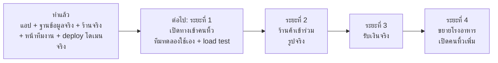

# แผนงาน Goose Man (ห่านบางมด)

> ไฟล์นี้ตอบ 3 คำถาม: **ทำอะไรไปแล้ว**, **อัปเดตอะไรล่าสุด** และ **จะทำอะไรต่อ**
> ส่วนวิธีการทำงานของระบบ (โค้ดอยู่ไหน รันยังไง) อยู่ใน [`PROJECT_GUIDE.md`](PROJECT_GUIDE.md)
>
> **อัปเดตล่าสุด:** 27 กันยายน 2569 · commit ล่าสุดตอนเขียน: `fec6620`
>
> **วิธีใช้:** ทำงานไหนเสร็จ ให้ย้ายจากส่วน C ไปส่วน A และเพิ่มบรรทัดในส่วน B ใน commit เดียวกับงานนั้น
> ตัดสินใจเรื่องไหนแล้ว ให้ย้ายจากส่วน D ไปตารางการตัดสินใจ (A.9)

---

## สรุปสั้น: ตอนนี้อยู่ตรงไหน

- **เว็บจริงขึ้นแล้ว:** แอปลูกค้า https://goose-man.tech และหน้าทีมงาน https://goastman.dev (Vercel + Supabase จริง)
- **แอปครบทั้งฝั่งผู้สั่ง ร้านค้า และคนหิ้ว** ทดสอบผ่านครบทุกชุด (unit 50, SQL 200, browser 72)
- **หน้าทีมงาน:** ADMIN / STAFF ดูภาพรวม แก้ปัญหาออเดอร์ โอนเงินคนหิ้ว คืนเงิน เปิด/ปิดร้าน จัดการคนหิ้ว โปร ทีมงาน ได้โดยไม่ต้องเขียน SQL · มี error log ให้เห็น error ที่ผู้ใช้เจอ
- **มีร้านจริงแล้ว** 12 ร้านของโรงอาหาร KFC (หลัก) 231 เมนู แต่รูปเมนูยังเป็น mockup
- **จ่ายเงิน:** ตอนนี้เงินสดอย่างเดียว · PromptPay + ตรวจสลิป SlipOK เขียนเสร็จแล้ว รอใส่ key และเลขบัญชีทีม
- **คนหิ้ว:** เข้าได้จากหน้าโปรไฟล์ เฉพาะคนที่ทีมเพิ่มในรายชื่อ มีหน้ารายได้ · ยังไม่ได้ลองครบวงจรด้วยบัญชีจริง
- **ก้าวต่อไปที่สำคัญที่สุด:** เพิ่มคนหิ้วชุดแรกในหน้าทีมงาน แล้วให้ทีมทดลองสั่งและหิ้วกันเอง (1.4, 1.11) + load test ช่วงเที่ยง (1.12)

```mermaid
flowchart LR
    A["ทำแล้ว<br/>แอป + ฐานข้อมูลจริง + ร้านจริง<br/>+ หน้าทีมงาน + deploy โดเมนจริง"] --> B["ต่อไป: ระยะที่ 1<br/>เปิดทางเข้าคนหิ้ว<br/>ทีมทดลองใช้เอง + load test"]
    B --> C["ระยะที่ 2<br/>ร้านค้าเข้าร่วม<br/>รูปจริง"]
    C --> D["ระยะที่ 3<br/>รับเงินจริง"]
    D --> E["ระยะที่ 4<br/>ขยายโรงอาหาร<br/>เปิดคนหิ้วเพิ่ม"]
```

---

## ส่วน A: ทำอะไรไปแล้ว

เรียงตามลำดับงานจริง (อ้างอิงรหัส commit ใน git)

### A.1 ตั้งต้นโปรเจกต์ และเปลี่ยนชื่อเป็น Goose Man · 23 ก.ย. 69

| commit | งาน |
|---|---|
| `275a6f6` | โค้ดตั้งต้น: แอป SvelteKit + backend Go/Fiber + Postgres (docker-compose) |
| `61d7544` | เปลี่ยนชื่อจาก Mod Man เป็น **Goose Man (ห่านบางมด)** |
| `792bf6c` | commit แรกบน repo ใหม่ |

### A.2 สร้างแอปฝั่งผู้สั่งใหม่ทั้งหมด และออกแบบตาม mockup · 23 ก.ย. 69

commit `d2b656e`

- สร้างหน้าจอหลัก 11 หน้าตามสเปก: login, หน้าแรก, รายชื่อร้าน, หน้าร้าน, ฝากซื้อ, สรุปคำสั่งซื้อ, จ่ายเงิน, ติดตาม, แชท, ส่งสำเร็จ, ประวัติ, โปรไฟล์
- เปลี่ยน state ทั้งหมดเป็น Svelte 5 runes (auth, cart, orders, checkout, nav)
- ออกแบบใหม่ตาม UX mockup `picture/Mod_Pass_Pase-1.png`: พื้นเรียบ, ชุดไอคอนเส้น, แถบหัว/แถบล่าง/เมนูล่างแบบเดียวกันทั้งแอป, หน้า PromptPay เต็มจอแทนป๊อปอัป
- ลดความเป็น "งาน AI" (ลดอีโมจิ, gradient, ลวดลายทั่วไป)
- ใส่ความรู้สึกดีตอนใช้ (delight): ห่านเดินตามเส้นทางในหน้าติดตาม, ของบินเข้าตะกร้า, มือถือสั่น, ตัวเลขยอดรวมเลื่อน, OTP เต็มจอ, ห่านในหน้าว่าง
- ปรับหน้าแรกที่เคยโล่งและหัวหน้าจอดูแยกกัน: รวมแถบหัวกับตำแหน่ง, ช่องค้นหา, ปุ่มสั่งซ้ำ, เพิ่มส่วนจุดรับ/จุดส่ง/ดีล

### A.3 ย้าย backend ไป Supabase, ร้าน Partner, login และข้อมูลผู้ใช้ · 24 ก.ย. 69

commit `7747da6`

- **เลิกใช้ backend Go** ย้ายกฎทั้งหมดไป Supabase: ตาราง, สิทธิ์ (RLS), ฟังก์ชันสั่งอาหารที่คิดราคาฝั่งเซิร์ฟเวอร์, Realtime, Storage, ข้อมูลตั้งต้น
- แอปรันด้วยข้อมูลเดโมได้เองถ้ายังไม่ใส่ key
- **ร้าน Partner:** แบนเนอร์หน้าร้าน, Fast lane, โปรของร้าน, โปรร่วมที่ต้องให้ Goose Man อนุมัติ, หน้า "จัดการร้านของฉัน" (แอปเดียวกัน แยกตามสิทธิ์)
- **Login + กรอกข้อมูลครั้งแรก:** ตรวจเบอร์ รหัสนักศึกษา, ยอมรับเงื่อนไขตาม PDPA, หน้าแก้ไขข้อมูล, หน้าเงื่อนไข/นโยบาย
- ใส่แบนเนอร์จริง และห่านเดินแบบสลับเฟรมจากภาพวาดจริง
- ปุ่ม "ฝากหิ้วเลย" ในหน้าแรกพาไปรายชื่อร้าน (เดิมไปหน้าฝากซื้อ)

### A.4 ระบบจัดเส้นทางคนหิ้ว และ benchmark · 24 ก.ย. 69

| commit | งาน |
|---|---|
| `49c6489` | พอร์ตตัวแก้ปัญหาเส้นทาง (OR-Tools PDPTW) จากโปรเจกต์ route optimize เดิมเป็น TypeScript: จัดลำดับรับ-ส่งแบบหาคำตอบดีที่สุด, แนะนำงานทางเดียวกัน · เพิ่ม unit test |
| `30d7ea9` | benchmark วัดความเร็ว + เทียบคุณภาพเส้นทางกับ OR-Tools + notebook สำหรับ Google Colab |

**ผลที่ได้ (รันบน Colab):** เส้นทางดีเท่า OR-Tools ทุกโจทย์ (ต่าง 0.00%) และเร็วกว่ามาก (4 งาน 0.68 ms เทียบกับ OR-Tools ~1 วินาที) → **ตั้งความจุคนหิ้วไว้ 4 งานต่อรอบ** รายละเอียดใน `PROJECT_GUIDE.md` ข้อ 12.2

### A.5 โหมดคนหิ้ว · 24 ก.ย. 69

| commit | งาน |
|---|---|
| `56be223` | ฐานข้อมูล: รายชื่อคนหิ้ว `rider_roster` (ระยะแรกให้ทีมเราหิ้วเอง), ถือได้ 4 งานต่อรอบ, เริ่มส่งแล้วห้ามรับเพิ่ม, คืนงานได้, `rider_board()` |
| `cdc74d5` | หน้าจอคนหิ้ว: บอร์ดงาน, รอบที่ถือเรียงตามเส้นทางที่ระบบจัด (พร้อมเวลารออาหาร), แนะนำงานทางเดียวกันสูงสุด 3 งาน, รับของ, คืนงาน, ยืนยัน OTP · ผู้สั่งได้แจ้งเตือนเมื่อคนหิ้วคืนงาน |

### A.6 Deploy และเอกสาร · 24-25 ก.ย. 69

| commit | งาน |
|---|---|
| `62736c2` | แก้เอกสารเก่าให้ตรงกับระบบ Supabase |
| `7c5f3fd` | deploy ขึ้น GitHub Pages อัตโนมัติทุกครั้งที่ push เข้า `main` (ทดสอบ → build → deploy), รองรับโดเมนของตัวเอง |
| `6d78770` | รวมงาน deploy และเอกสารจาก branch `beta/claude/read-project-f41lis` |

### A.7 ร้านจริง, ขนาดเมนู, โลโก้ร้าน · 25 ก.ย. 69

| commit | งาน |
|---|---|
| `186524f` | ฐานข้อมูลรองรับโลโก้และรูปร้านที่ Partner ตั้งเอง (รูปต้องอยู่ในโฟลเดอร์ร้านตัวเองเท่านั้น), แสดงโลโก้หรือตัวอักษรแรกของชื่อร้าน |
| `3e78141` | **แทนร้านสมมติทั้งหมดด้วยร้านจริง 12 ร้าน** ของโรงอาหาร KFC (หลัก) จาก PDF · **เลือกธรรมดา/พิเศษในเมนูเดียว** (ฐานข้อมูลคิดราคาพิเศษเอง) · **รูปเมนู mockup** แทนตัวหนังสือ · รูปร้านจริงตัดจาก PDF · แก้บั๊กขนาดพิเศษหายตอนสั่ง · ย้าย test SQL และ browser เข้า repo |

### A.8 ปรับการใช้งานตามที่ทีมขอ และเอกสารทีม · 25 ก.ย. 69

| commit | งาน |
|---|---|
| `9e762fa` | ออกแบบหน้า login ใหม่ (เต็มจอ, ห่านยืน) |
| `7b9f450` | **login แล้วเข้าแอปได้เลย ขอข้อมูลตอนสั่งครั้งแรก** · ข้อมูลคงที่ผูกกับบัญชี ข้อมูลที่เปลี่ยนได้เลือกทุกออเดอร์ · ฐานข้อมูลไม่ให้สั่ง/รับงานถ้าข้อมูลไม่ครบ |
| `f5110b4` | **เอาปุ่มโหมดคนหิ้วออกจากหน้าโปรไฟล์** เพราะคนหิ้วต้องผ่านการ verify จากทีมก่อน |
| `6cd3474` | **คู่มือทีม `PROJECT_GUIDE.md`** แทนเอกสารส่งมอบเก่า |

### A.10 ขึ้นเว็บจริง, รับเงิน, หน้าทีมงาน, error log · 26-27 ก.ย. 69

| commit | งาน |
|---|---|
| - | **Supabase project จริง** (`pguhzjtdwgualqeqzleu`) รัน migration + seed, เปิด Google login, ตั้ง Site URL / Redirect URLs |
| `b6ab0ed` | **Deploy บน Vercel** (`vercel.json`) + โดเมน `goose-man.tech` |
| `7236e03`, `9e0dbe5` | หน้า login เรียบขึ้น · Google ให้เลือกบัญชีที่มีในเครื่องได้ ไม่ต้อง login ใหม่ |
| `2017528` | ซ่อน PromptPay ในเว็บจริง จนกว่าจะตั้งค่า API (เปิดเองเมื่อตั้งค่าครบ) |
| `3adfea2` | login ครั้งแรกทักด้วยห่านร้อง (หัวห่าน 2 เฟรม) |
| `99a1fbc` | **PromptPay เข้าบัญชีทีม + ตรวจสลิปด้วย SlipOK** (Edge Function `verify-slip`) · หลัง OTP ระบบบอกยอดที่ทีมต้องโอนให้คนหิ้ว |
| `a8ffdef`, `ea221f8` | ร่างดีไซน์หน้าทีมงาน `ADMIN_DESIGN_BRIEF.md` |
| `e196209` | **หน้าทีมงาน: ฐานข้อมูล** role ADMIN / STAFF, `admin_log`, ฟังก์ชัน `admin_*` 1 ตัวต่อ 1 ปุ่ม |
| `fec6620` | **หน้าทีมงาน: หน้าเว็บ** ที่ `goastman.dev` ตามแบบที่ทีมออกแบบ ใช้ได้ทั้ง PC และมือถือ · ADMIN คนแรก `natthawut.napa@mail.kmutt.ac.th` |
| `25b8e26`, `9786526` | **Error log** error ที่ผู้ใช้เจอในเว็บส่งเข้าฐานข้อมูลเอง ทีมดูที่หน้า "ข้อผิดพลาด" · อัปเดตเอกสาร |

### A.9 การตัดสินใจที่ทำไปแล้ว

เก็บไว้เพื่อไม่ต้องถกเรื่องเดิมซ้ำ ถ้าจะเปลี่ยน ให้แก้ตารางนี้ด้วย

| เรื่อง | ตัดสินใจว่า | เหตุผล |
|---|---|---|
| Backend | ใช้ Supabase ทั้งหมด เลิก Go | ไม่ต้องดูแลเซิร์ฟเวอร์เอง, มี login/realtime/storage ในตัว |
| แอปร้านค้า | แอปเดียวกับผู้สั่ง แยกตามสิทธิ์ | ดูแลโค้ดชุดเดียว |
| กฎสำคัญอยู่ที่ไหน | ในฐานข้อมูล (ราคา, สิทธิ์, สถานะ) | แก้โค้ดแอปแล้วโกงไม่ได้ |
| ร้านสมมติ | แทนด้วยร้านจริงทั้งหมด | ใช้ทดลองจริงได้ |
| KFC (หลัก) กับโรงชาย | เป็นคนละที่ | ตามข้อมูลจริง |
| ขนาดธรรมดา/พิเศษ | เลือกได้ในเมนูเดียว | ไม่ทำให้รายการเมนูยาวเป็นสองเท่า |
| รูปเมนู | ใช้ mockup ไปก่อน ไม่ใช้ตัวหนังสือล้วน | รอรูปจริงจากร้าน |
| ข้อมูลร้านที่ไม่มี | ไม่แต่ง (คะแนน, รีวิว, โปร, สถานะ Partner, เบอร์เจ้าของร้าน) | ความน่าเชื่อถือ และข้อมูลส่วนบุคคล |
| คนหิ้วระยะแรก | ทีมเราหิ้วเอง | เริ่มเล็ก ควบคุมคุณภาพได้ |
| คนหิ้ววิธีเข้าร่วม | ต้องผ่านการ verify จากทีม ไม่มีปุ่มสมัครเอง | ความปลอดภัยของผู้สั่ง |
| ความจุคนหิ้ว | 4 งานต่อรอบ | benchmark: คำนวณเร็ว ส่งทันเวลาเกือบทุกกรณี |
| ขอข้อมูลผู้ใช้เมื่อไร | ตอนสั่งครั้งแรก ไม่ใช่ตอน login | ให้ลองดูแอปก่อนได้ |
| ข้อมูลผู้ใช้ | คงที่ผูกกับบัญชี (ชื่อเล่น, เบอร์, คณะ, รหัส) · เลือกทุกออเดอร์ (จุดส่ง, หมายเหตุ, วิธีจ่าย) | ไม่ต้องกรอกซ้ำ |
| Benchmark หนัก | รันบน Google Colab | เครื่องในทีมบางเครื่อง RAM น้อย |
| Deploy | Vercel อัตโนมัติจาก `main` (เดิม GitHub Pages) | ฟรี, ต่อโดเมนเองได้ง่าย, ได้ลิงก์ preview ต่อ branch |
| โดเมน | `goose-man.tech` = แอปลูกค้า · `goastman.dev` = หน้าทีมงาน | ลูกค้าไม่เห็นหน้าทีมงาน, ใช้โดเมนที่จดผิดชื่อให้เกิดประโยชน์ |
| รับเงิน | PromptPay เข้าบัญชีทีม ตรวจสลิปด้วย SlipOK · หลัง OTP ทีมโอนให้คนหิ้วเอง | ง่ายที่สุด ไม่ต้องมี payment gateway · ระหว่างรอตั้งค่าใช้เงินสด |
| งานของทีม | ทำผ่านหน้าทีมงาน ไม่ใช่ SQL Editor · ทุกปุ่มตรวจสิทธิ์ในฐานข้อมูลและบันทึกว่าใครทำ | กันพลาด และย้อนดูได้ |
| role ทีมงาน | ADMIN (ทุกอย่าง) / STAFF (ออเดอร์ เงิน ร้าน) | STAFF เฝ้ากะเที่ยงได้โดยไม่แตะรายชื่อคนหิ้วและทีม |
| ติดตาม error | เก็บในตาราง Supabase ของเราเอง ไม่ใช้ Sentry | ไม่ต้องสมัครบริการเพิ่ม ข้อมูลไม่ออกนอกระบบ ทีมเห็นในหน้าทีมงานเลย |
| Git | push ทั้ง `origin` และ `beta`, commit งานที่เสร็จก่อนเริ่มงานใหม่ | ย้อนกลับได้ทีละเรื่อง |

---

## ส่วน B: การอัปเดตล่าสุด

ใหม่สุดอยู่บน

### 27 ก.ย. 69 (ต่อ 6)

- **ฟรีค่าหิ้วต้องผ่านทีม:** ร้านเปิดฟรีค่าหิ้วในโปรของร้านเองไม่ได้แล้ว (เป็นเงินของ Goose Man) ขอได้เฉพาะในโปรร่วมซึ่ง ADMIN อนุมัติ · ฐานข้อมูลบังคับ · migration `20261007000000_free_delivery_team_only.sql` รันแล้ว · SQL 280, browser 117

### 27 ก.ย. 69 (ต่อ 5)

- **ร้านจัดการร้านเองได้เต็มที่:** เพิ่ม/แก้/ลบเมนู, ใส่รูปเมนู, ราคาและราคาพิเศษ, หมวดหมู่ · แก้ชื่อร้าน, ประเภท, รายละเอียด, คิว, โลโก้, รูปร้าน · ร้านเมนูตอนนี้ยังเป็น mockup จากเอกสาร ให้ร้านแก้เป็นของจริง
- ตัดสินใจ D5: ร้านแก้เองได้ทันที ไม่ต้องรออนุมัติ (ทีมเห็นทุกการเปลี่ยนแปลงในบันทึกการทำงาน)
- migration `20261006000000_partner_menu.sql` รันบน Supabase จริงแล้ว · SQL 276, browser 116

### 27 ก.ย. 69 (ต่อ 4)

- **ทีมงานใช้อีเมลส่วนตัวได้:** ADMIN เพิ่มอีเมลอะไรก็ได้ในหน้าทีมงาน (มจธ. หรือ Gmail) แล้วคนนั้น login ที่ `goastman.dev` ได้ · คนนอกที่ใช้อีเมลส่วนตัวยังสมัครไม่ได้เหมือนเดิม · บัญชีทีมงานแบบนี้เป็นคนหิ้วไม่ได้
- migration `20261005000000_team_personal_email.sql` รันบน Supabase จริงแล้ว (ผ่าน Supabase CLI) · SQL test 254

### 27 ก.ย. 69 (ต่อ 3)

- **Dashboard ร้านค้า:** หน้าจัดการร้านแบ่ง 3 แท็บ · ภาพรวม: ยอดขายวันนี้, กราฟ 7/30 วัน, ยอดเดือนนี้, เมนูขายดี, ออเดอร์ที่กำลังมา (ไม่มีข้อมูลผู้สั่ง), ออเดอร์ล่าสุด · เปิด/ปิดรับออเดอร์เอง · แท็บเมนู: กดเมนูหมดเอง
- migration ใหม่ `20261004000000_partner_dashboard.sql` รันบน Supabase จริงแล้ว (ผ่าน Supabase CLI) และ deploy แล้ว
- test: SQL 247, browser 110

### 27 ก.ย. 69 (ต่อ 2)

- **พร้อมรับงาน / ออฟไลน์:** สวิตช์ในหน้าคนหิ้ว · หน้าแรกลูกค้าโชว์จำนวนคนหิ้วที่พร้อมจริง (เลิกซ่อน) · หน้าทีมงานเห็นว่าใครพร้อม
- **เตือนงานใหม่:** เสียง + สั่น + แจ้งเตือนในแอป เมื่อเปิดพร้อมรับงานและเปิดหน้าไว้ (push ตอนปิดแอปยังไม่มี)
- **สมัครเป็นคนหิ้ว:** ฟอร์มในแอป → ADMIN อนุมัติ/ไม่อนุมัติพร้อมเหตุผลในหน้าทีมงาน (มี badge บนเมนูคนหิ้ว)
- **ทิปปัดเศษ:** ท้ายหน้าสรุปคำสั่งซื้อถาม "ปัดเป็น 55 ฿ ไหม?" ส่วนต่างเป็นทิป รวมในยอดที่จ่ายและในยอดที่ทีมโอนให้คนหิ้ว · เอาทิปหลังส่ง (+5/+10 ที่ไม่มีใครจ่ายจริง) ออก
- migration `20261003000000_rider_tools.sql` **deploy แล้ว 27 กันยายน 2569** ต่อจาก `20261002` บนโปรเจกต์ `goose-man` · ตรวจ schema, สิทธิ์ฟังก์ชัน, สูตรทิป และ API `riders_online` ผ่านแล้ว · ยังต้องทดลอง flow พร้อมรับงาน/ใบสมัคร/ทิปผ่านบัญชีผู้ใช้จริง
- test: unit 52, SQL 233, browser 102

### 27 ก.ย. 69 (ต่อ)

- **โหมดคนหิ้วเปิดแล้ว:** ปุ่มในหน้าโปรไฟล์ เห็นเฉพาะคนที่ทีมเพิ่มในรายชื่อ · หน้าคนหิ้วบอกยอดรอทีมโอนและเลขที่จะโอนเข้า · หน้ารายได้ใหม่ (รอโอน, ส่งวันนี้, โอนแล้ว 30 วัน, เหตุผลของยอดต่องาน)
- โหมดเดโม: ปุ่ม "เข้าเป็นคนหิ้วทดลอง" ในหน้า login · browser test คนหิ้วกลับมา (รวม 94 ข้อ)
- พิกัดตึกวัดจากผังแม่บท มจธ. แทนค่าเดา
- ไม่มี migration ใหม่: หน้ารายได้อ่านออเดอร์ของตัวเองผ่านสิทธิ์ที่มีอยู่แล้ว

### 27 ก.ย. 69

**สิ่งที่ทีมเห็นเปลี่ยน**
- **หน้าทีมงานที่ https://goastman.dev** login ด้วย Google (อีเมลต้องอยู่ในรายชื่อทีม) มี 10 หน้า: ภาพรวม, ออเดอร์, การเงิน, ร้านค้า, คนหิ้ว, Partner และโปร, ข้อผิดพลาด, ทีมงาน, บันทึกการทำงาน, ตั้งค่า
- หน้า "ข้อผิดพลาด": error ที่ผู้ใช้เจอในเว็บ รวมเป็นกลุ่มพร้อมจำนวนครั้ง เครื่อง และหน้าที่เกิด · เลขบนเมนู = error ที่ยังไม่แก้ใน 24 ชม.
- PromptPay + ตรวจสลิป (ยังซ่อนในเว็บจริงจนกว่าจะใส่ key)

**สิ่งที่เปลี่ยนเบื้องหลัง**
- migration 3 ไฟล์: `20260930000000_promptpay_slips.sql`, `20261001000000_team_console.sql` (**รันแล้ว**), `20261002000000_client_errors.sql` (**deploy แล้ว 27 กันยายน 2569**)
- test: unit 50, SQL 200, browser 72
- `goastman.dev` เลิก redirect ไป `goose-man.tech` แล้ว (ตั้งใน Vercel)
- เอกสาร: `PROJECT_GUIDE.md` เพิ่มข้อ 6.8 หน้าทีมงาน, 6.9 error log, ข้อ 16 ทำงานผ่านหน้าทีมงาน

### 26 ก.ย. 69

- Supabase project จริง + Google login ใช้งานได้บนเว็บจริง
- ย้าย deploy ไป Vercel, โดเมน `goose-man.tech`
- login ให้เลือกบัญชีในเครื่องได้, แก้ login แล้วเด้งไป localhost
- ซ่อน PromptPay ในเว็บจริง, ห่านทักตอน login ครั้งแรก

### 25 ก.ย. 69

**สิ่งที่ผู้ใช้เห็นเปลี่ยน**
- login แล้วเข้าหน้าแรกทันที ทักด้วยชื่อจาก Google ("สวัสดี กูส")
- สั่งครั้งแรกจะเจอฟอร์ม "ก่อนสั่งครั้งแรก" กรอกเสร็จกลับมาหน้าสรุปคำสั่งซื้อเดิม ตะกร้าไม่หาย
- หน้าสรุปคำสั่งซื้อมีการ์ดข้อมูลผู้สั่ง "ผูกกับบัญชี"
- ฟอร์มข้อมูลไม่ถามจุดส่งแล้ว (เลือกตอนสั่ง)
- ฝากซื้อ: ข้อความที่พิมพ์ไม่หายระหว่างไปกรอกข้อมูล
- หน้าโปรไฟล์ไม่มีปุ่มโหมดคนหิ้ว
- หน้า login ออกแบบใหม่
- ร้านจริง 12 ร้าน, รูปร้านจริง, รูปเมนู mockup, เลือกธรรมดา/พิเศษ
- ร้านที่ยังไม่มีรีวิวแสดง "ร้านใหม่ในแอป" แทนดาว
- จุดรับที่ยังไม่มีร้านในแอปขึ้นว่า "ฝากซื้อ"

**สิ่งที่เปลี่ยนเบื้องหลัง**
- migration ใหม่ 2 ไฟล์: `20260928000000_kfc_menu_sizes.sql`, `20260929000000_profile_at_first_order.sql`
- แก้บั๊ก: ขนาดพิเศษหายตอนสั่งในโหมดเดโม
- test SQL และ browser ย้ายเข้า repo (`frontend/tests/`) รันด้วย `npm run test:sql`, `npm run test:e2e`
- เอกสาร: `PROJECT_GUIDE.md` ใหม่, `PLAN.md` (ไฟล์นี้), ลบ `PROJECT_HANDOVER.md`, แก้ README ทุกไฟล์ให้ตรงกัน
- push ขึ้นทั้งสอง repo แล้ว

### 24 ก.ย. 69

- ย้ายไป Supabase, ร้าน Partner, login + ข้อมูลผู้ใช้ + PDPA
- ระบบจัดเส้นทาง + benchmark บน Colab
- โหมดคนหิ้ว (ตอนนั้นเข้าได้จากหน้าโปรไฟล์)
- deploy GitHub Pages

### 23 ก.ย. 69

- ตั้งต้นโปรเจกต์, เปลี่ยนชื่อเป็น Goose Man, สร้างแอปผู้สั่งใหม่ตาม mockup

---

## ส่วน C: จะทำอะไรต่อ

ขนาดงาน: **S** = ไม่เกินครึ่งวัน · **M** = 1-2 วัน · **L** = หลายวัน/ต้องประสานคนนอก
"ต้องการ" = สิ่งที่ต้องได้จากทีมหรือคนนอกก่อนเริ่มได้

### ระยะที่ 1: พร้อมให้ทีมทดลองใช้จริง (Pilot ภายในทีม)

**เป้าหมาย:** ทีมเราสั่งอาหารจากโรงอาหาร KFC (หลัก) และหิ้วส่งกันเองได้จริงผ่านแอปบนเว็บ ด้วยบัญชี มจธ. จริง

| # | งาน | รายละเอียด | ต้องการ | ขนาด | เสร็จเมื่อ |
|---|---|---|---|---|---|
| 1.1 | ~~**สร้าง Supabase project**~~ ✅ เสร็จ 26 ก.ย. | สมัคร, สร้าง project (Singapore), รัน migration 6 ไฟล์ + seed ตามลำดับใน `supabase/README.md` | บัญชี Supabase ของทีม | S | ตารางและร้าน 12 ร้านขึ้นในฐานข้อมูล |
| 1.2 | ~~**เปิด Google login**~~ ✅ เสร็จ | สร้าง OAuth client ใน Google Cloud, ใส่ใน Supabase, ตั้ง Redirect URLs (localhost + เว็บจริง) | บัญชี Google Cloud | S | login ด้วยอีเมล มจธ. ได้ อีเมลอื่นถูกปฏิเสธ |
| 1.3 | ~~**ใส่ key ในแอป**~~ ✅ เสร็จ | `frontend/.env` สำหรับเครื่องพัฒนา และ Vercel Environment Variables `PUBLIC_SUPABASE_URL`, `PUBLIC_SUPABASE_ANON_KEY` สำหรับเว็บจริง (anon key เท่านั้น) | Project URL + anon key | S | เว็บบน GitHub Pages เป็นโหมดจริง |
| 1.4 | **ทดสอบโหมดจริงครบวงจร** | ลองสั่ง → รับงาน → รับของ → OTP → รีวิว ด้วยบัญชีจริง 2 คน, ลองฝากซื้อ, ลองยกเลิก, ลองแชทและส่งรูป, ลองบัญชีร้านที่เชิญ | 1.1-1.3, บัญชี มจธ. 2-3 บัญชี | M | ทุกขั้นทำงานบนเว็บจริง ไม่มี error |
| 1.5 | **ตัดสินใจเรื่องค่ากล่อง 5 บาท** แล้วทำ | ดูส่วน D ข้อ D1 | คำตอบจากทีม + ถามร้าน | S-M | ยอดในแอปตรงกับที่ร้านเก็บจริง |
| 1.6 | **ขั้นตอน verify คนหิ้ว** | กำหนดว่าตรวจอะไร (ดูส่วน D ข้อ D3), เขียนเป็นขั้นตอน, เพิ่มชื่อคนในทีมที่ผ่านใน `rider_roster` | ทีมตกลงเกณฑ์ | S | มีรายชื่อคนหิ้วชุดแรกในฐานข้อมูล |
| 1.7 | ~~**ทางเข้าโหมดคนหิ้ว**~~ ✅ เสร็จ 27 ก.ย. | ปุ่มในหน้าโปรไฟล์ เฉพาะคนในรายชื่อ · browser test คนหิ้วกลับมาแล้ว | - | - | - |
| 1.8 | **เก็บพิกัดตึกจริง** 🟡 | ✅ วัดจากผังแม่บท มจธ. ครบ 9 จุดที่ใช้ (คลาดราว 10-20 ม.) · **เหลือ:** โรงชายอยู่ตึกไหน, ยืนยันว่า Green Canteen อยู่ S14, ถ้าทดลองจริงแล้วเส้นทางแปลกค่อยเดินวัดทางเข้าจริงใน `frontend/src/lib/routing/places.ts` | คำตอบเรื่องโรงชาย | S | เส้นทางแนะนำสมเหตุสมผลเมื่อเดินจริง |
| 1.9 | **ตรวจเงื่อนไขและนโยบายความเป็นส่วนตัว** | อ่าน `frontend/src/lib/data/legal.ts` ให้ตรงกับการเก็บข้อมูลจริง (ข้อมูลอะไร เก็บนานแค่ไหน ใครเห็น ติดต่อใคร) ถ้าแก้ต้องเปลี่ยน `TERMS_VERSION` | คนรับผิดชอบเรื่อง PDPA ของทีม | S | ข้อความตรงกับที่ระบบทำจริง |
| 1.10 | ~~**วิธีจ่ายเงินช่วงทดลอง**~~ ✅ เสร็จ | ซ่อน PromptPay ในโหมดจริง (เงินสดอย่างเดียว) จะกลับมาเองเมื่อตั้ง `PUBLIC_PROMPTPAY_API_URL` ใน Vercel | - | S | ผู้ใช้ไม่เข้าใจผิดว่าจ่ายผ่าน QR จำลองได้ |
| 1.11 | **ทดลองใช้จริงช่วงเที่ยง** | ทีมสั่งและหิ้วจริง 1-2 สัปดาห์ จดปัญหา เวลาส่งจริง คิวจริงของแต่ละร้าน | 1.1-1.10 | L | มีบันทึกปัญหาและตัวเลขจริง ใช้ปรับระยะถัดไป |
| 1.12 | **Load test ช่วงเที่ยง** | สคริปต์จำลองคนสั่งและคนหิ้วรับงานพร้อมกัน (เช่น 50-100 คนใน 15 นาที) ยิงไปที่ฟังก์ชันในฐานข้อมูล วัดเวลาตอบและ error · ระวังโควตาแพ็กเกจฟรีของ Supabase ถ้ายิงใส่ฐานข้อมูลจริง | ควรมี 1.14 ก่อน | M | รู้ว่ารับคนพร้อมกันได้เท่าไร และคอขวดอยู่ตรงไหน |
| 1.13 | **Monitoring** 🟡 | ✅ error log (หน้า "ข้อผิดพลาด") และ deploy migration `20261002000000_client_errors.sql` บน Supabase จริงแล้ว 27 กันยายน 2569 · **เหลือ:** แจ้งเตือนเมื่อเว็บล่ม (เช่น uptime check ฟรี), ดูสถิติ Supabase ช่วงเที่ยง | - | S | ทีมรู้ก่อนผู้ใช้บอก |
| 1.14 | **Staging แยก** | ตอนนี้ลิงก์ preview ของ Vercel ใช้ฐานข้อมูลจริงตัวเดียวกัน · สร้าง Supabase project ที่สองสำหรับทดสอบ แล้วตั้งค่า env ของ Preview ใน Vercel ให้ชี้ไปที่นั่น | บัญชี Supabase | S-M | ทดสอบ/ load test ได้โดยไม่แตะข้อมูลจริง |
| 1.15 | **Browser test ของหน้าทีมงาน** | ตอนนี้ตรวจด้วย SQL test (ทุกปุ่ม) + ดูภาพหน้าจอ · เพิ่มใน `tests/e2e.mjs`: login เดโม, ยกเลิกออเดอร์, ปลดล็อก OTP, บันทึกโอน, STAFF ไม่เห็นหน้าของ ADMIN | ไม่มี | S | test กดหน้าทีมงานผ่านครบ |

**หลังทดลอง:** ปรับ "คิวโดยประมาณ" ของแต่ละร้านใน `data/stores.ts` ให้ตรงกับเวลาจริง และปรับค่าเดินเร็ว/ชั้นใน `routing/cost.ts` ถ้าคลาดเคลื่อน

### ระยะที่ 2: ร้านค้าเข้าร่วม

**เป้าหมาย:** ร้านใน KFC (หลัก) มาเป็น Partner ดูแลหน้าร้านเอง และแอปมีรูปอาหารจริง

| # | งาน | รายละเอียด | ต้องการ | ขนาด | เสร็จเมื่อ |
|---|---|---|---|---|---|
| 2.1 | **คุยกับร้าน** | อธิบาย Goose Man, ขออนุญาตใช้ชื่อและเมนู, ถามเรื่องค่ากล่อง, Fast lane, สนใจเป็น Partner ไหม | คนในทีมไปคุย | L | มีร้านตกลงเข้าร่วมอย่างน้อย 2-3 ร้าน |
| 2.2 | **รูปอาหารจริง** | ถ่ายรูปเมนูจริง (หรือขอจากร้าน), ใส่ `imageUrl` แทนรูป mockup ทีละเมนู | 2.1, คนถ่ายรูป | M-L | ร้านที่เข้าร่วมไม่มีรูป mockup เหลือ |
| 2.3 | ~~**ปุ่มอัปโหลดโลโก้และรูปร้านในหน้า Partner**~~ ✅ เสร็จ 27 ก.ย. | ฐานข้อมูล, `catalog.updateStorefront` (`logoFile`, `photoFile`) และ `api/live.ts` รองรับแล้ว เหลือหน้าจอใน `PartnerScreen.svelte` + test | ไม่มี | S | Partner เปลี่ยนโลโก้/รูปร้านเองได้ |
| 2.4 | **เชิญร้านเป็น Partner** | `insert into partner_invites ...` ตาม `PROJECT_GUIDE.md` ข้อ 16.2 | 2.1, อีเมลเจ้าของร้าน | S | เจ้าของร้าน login แล้วเห็นหน้าจัดการร้าน |
| 2.5 | ~~**ร้านเปิด/ปิดร้าน และปิดเมนูที่หมดเอง**~~ ✅ เสร็จ 27 ก.ย. | สวิตช์ในแท็บภาพรวมและแท็บเมนูของหน้า Partner | - | - | - |
| 2.6 | ~~**ให้ร้านแก้เมนูและราคาเอง**~~ ✅ เสร็จ 27 ก.ย. (ไม่ต้องอนุมัติ) | ตอนนี้ทีมแก้ใน `stores.ts` + ฐานข้อมูล · ต้องออกแบบว่าแก้ราคาแล้วต้องอนุมัติไหม | ตัดสินใจ D5 | M-L | ร้านแก้เมนูได้โดยไม่ต้องผ่านทีม (หรือผ่านการอนุมัติ) |
| 2.7 | **แจ้งเตือนร้านเมื่อมีออเดอร์** (ถ้าร้านทำ Fast lane) 🟡 ร้านเห็น "ออเดอร์ที่กำลังมา" ในแท็บภาพรวมแล้ว (รีเฟรช 30 วินาที) · เหลือเสียงเตือน | ร้านต้องรู้ว่ามีออเดอร์จากแอปเข้ามา | ตัดสินใจว่าร้านต้องเห็นออเดอร์หรือไม่ | M | ร้าน Fast lane เห็นออเดอร์ที่ต้องทำ |

### ระยะที่ 3: เงินจริง

**เป้าหมาย:** จ่ายผ่าน PromptPay ได้จริง และคนหิ้วได้ค่าหิ้วอย่างเป็นระบบ

| # | งาน | รายละเอียด | ต้องการ | ขนาด | เสร็จเมื่อ |
|---|---|---|---|---|---|
| 3.1 | ~~**เลือกวิธีรับเงิน**~~ ✅ | PromptPay เข้าบัญชีทีม + ตรวจสลิปด้วย **SlipOK** | - | - | - |
| 3.2 | **QR จริง + ตรวจสลิปอัตโนมัติ** 🟡 โค้ดเสร็จ, deploy แล้ว | QR PromptPay จริงตามยอดออเดอร์, แนบสลิป, Edge Function `verify-slip` ตรวจกับ SlipOK · **เหลือ:** ใส่ secret `SLIPOK_API_KEY`/`SLIPOK_BRANCH_ID` และ `PUBLIC_PROMPTPAY_API_URL`/`PUBLIC_PROMPTPAY_ID` ใน Vercel แล้วทดลองโอนจริง 1 ครั้ง | เลข PromptPay ทีม, SlipOK key | S | โอนจริงแล้วออเดอร์ขึ้นให้คนหิ้วเอง |
| 3.3 | **เงินพักจนส่งสำเร็จ และคืนเงินเมื่อยกเลิก** 🟡 | ✅ เงินเข้าบัญชีทีม, หลัง OTP ระบบบอกยอดที่ต้องโอนให้คนหิ้ว ทีมโอนเองแล้วบันทึกในหน้าทีมงาน → การเงิน · ✅ ยกเลิกหลังจ่ายขึ้นในรายการ "คืนเงิน" ทีมโอนคืนเองแล้วบันทึก · **เหลือ:** คืนเงินอัตโนมัติ, ออเดอร์ PromptPay ที่ไม่จ่ายค้างอยู่ (ยังไม่หมดอายุเอง) | 3.2 | M | ยกเลิกแล้วได้เงินคืน, ส่งสำเร็จแล้วคนหิ้วได้เงิน |
| 3.4 | **สรุปรายได้คนหิ้ว** 🟡 | ✅ ทีมดูรายการที่ต้องโอนได้ในหน้าทีมงาน → การเงิน (มี QR PromptPay ของคนหิ้ว, export CSV) · ✅ หน้ารายได้ของคนหิ้ว (รอโอน, วันนี้, โอนแล้ว) · ✅ ทิปปัดเศษตอนสั่ง รวมในยอดโอน (ตอนนี้ผู้ซื้อกดให้ทิปได้แต่ยังไม่มีทางจ่ายทิปเข้ามา จึงยังไม่รวมในยอดโอน) | 3.3 | M | คนหิ้วเห็นรายได้ ทีมจ่ายเงินได้ถูกต้อง |

### ระยะที่ 4: ขยาย

| # | งาน | รายละเอียด | ต้องการ | ขนาด |
|---|---|---|---|---|
| 4.1 | **เพิ่มโรงอาหารอื่น** | โรงชาย, Green Canteen 190 ปี (ขั้นตอนใน `PROJECT_GUIDE.md` ข้อ 16.7) | ข้อมูลร้านและเมนูจริง | M ต่อโรงอาหาร |
| 4.2 | ~~**หน้า admin**~~ ✅ เสร็จ 27 ก.ย. | หน้าทีมงานที่ `goastman.dev` (ดู A.10) | - | - |
| 4.3 | **แจ้งเตือนบนมือถือ (push)** 🟡 เตือนในแอปแล้ว (เสียง/สั่นตอนเปิดหน้าคนหิ้ว) · เหลือ push ตอนปิดแอป | แจ้งผู้สั่งเมื่อคนหิ้วรับงาน/ใกล้ถึง, แจ้งคนหิ้วเมื่อมีงานใหม่ | ไม่มี | M-L |
| 4.4 | ~~**จำนวนคนหิ้วที่ออนไลน์**~~ ✅ เสร็จ 27 ก.ย. | สถานะพร้อมรับงานของคนหิ้ว แล้วแสดงจำนวนในหน้าแรก (ตอนนี้ซ่อนในโหมดจริง) | ระยะที่ 1 เสร็จ | M |
| 4.5 | **แผนที่ในแอป** | แผนที่แคมปัสแสดงจุดรับ-ส่งและเส้นทางคนหิ้ว | พิกัดจริง (1.8) | M-L |
| 4.6 | **เส้นทางเดินจริง** | แทนการคิดระยะเส้นตรง × 1.3 ด้วยเส้นทางเดินจริงในแคมปัส (`travelSeconds` ใน `routing/cost.ts`) | ข้อมูลทางเดิน | L |
| 4.7 | **เปิดรับคนหิ้วเพิ่ม** 🟡 ฟอร์มสมัคร + อนุมัติในหน้าทีมงานเสร็จแล้ว · เหลือเกณฑ์ verify (D3) | ยังต้อง verify ทุกคน · อาจทำฟอร์มสมัครให้ทีมตรวจ แทนการเพิ่มชื่อเอง | ระยะที่ 1-3, ขั้นตอน verify | M |
| 4.8 | **ใช้แอปแบบติดตั้ง (PWA) เต็มรูปแบบ** | ทำงานตอนเน็ตไม่ดี, ไอคอนและหน้าเปิดแอปครบทุกระบบ | ไม่มี | M |

### งานดูแลที่ทำได้ตลอด

- ทุกครั้งที่แก้ฐานข้อมูล: migration ใหม่ + เพิ่มใน `frontend/tests/sql.mjs` + `supabase/README.md` + `PROJECT_GUIDE.md` ข้อ 11.1
- อัปเดต package เป็นระยะ แล้วรัน test ครบทุกชุด
- เพิ่ม test คนหิ้วใน browser test กลับมาเมื่อเปิดทางเข้า (1.7)
- ให้ CI บน GitHub รัน SQL test ด้วย (ตอนนี้รันแค่ unit test และ build)
- ดูหน้า "ข้อผิดพลาด" หลัง deploy ทุกครั้ง และช่วงเที่ยงของวันที่มีคนใช้

---

## ส่วน D: เรื่องที่รอการตัดสินใจ

| # | เรื่อง | ตัวเลือก | ข้อแนะนำ |
|---|---|---|---|
| D1 | **ค่ากล่อง 5 บาท** (8 ร้าน มีหมายเหตุในคำอธิบายร้าน) | ก. บวกรวมในราคาเมนู · ข. แยกบรรทัด "ค่ากล่อง" ในสรุปคำสั่งซื้อ | **ข.** โปร่งใสกว่า และราคาเมนูในแอปตรงกับป้ายหน้าร้าน · ต้องถามร้านก่อนว่าคิดต่อกล่อง (ต่อจาน) หรือต่อออเดอร์ และเครื่องดื่มคิดด้วยไหม |
| D2 | ~~**ทางเข้าโหมดคนหิ้ว**~~ ✅ ตัดสินแล้ว | **ก.** ปุ่มในหน้าโปรไฟล์ แสดงเฉพาะคนในรายชื่อ | - |
| D3 | **เกณฑ์ verify คนหิ้ว** | เช่น บัตรนักศึกษา, สัมภาษณ์สั้น, อบรมวิธีรับ-ส่งและ OTP, เซ็นข้อตกลง | กำหนดเป็นรายการตรวจ และจดว่าใคร verify วันไหน (ใส่ใน `note` ของ `rider_roster`) |
| D4 | ~~**วิธีรับเงินจริง**~~ ✅ ตัดสินแล้ว | **ข.** PromptPay เข้าบัญชีทีม + ตรวจสลิปด้วย SlipOK · หลัง OTP ทีมโอนให้คนหิ้วตามยอดในระบบ | - |
| D5 | ~~**ใครแก้เมนูและราคา**~~ ✅ ตัดสินแล้ว | **ข.** ร้านแก้เองทันที (ข้อมูลตอนนี้เป็น mockup ร้านต้องแก้เป็นของจริง) · ทีมเห็นทุกการเปลี่ยนแปลงในบันทึกการทำงาน | - |
| D6 | **ค่าหิ้ว** | คงไว้ 15 / 20 บาท หรือปรับหลังทดลอง | ใช้ข้อมูลจากการทดลอง (1.11) เวลาเดินจริงต่องาน |

---

## ส่วน E: ความเสี่ยงและข้อจำกัดที่ต้องรู้

| เรื่อง | ผลกระทบ | วิธีรับมือ |
|---|---|---|
| ยังไม่เคยสั่ง-ส่งครบวงจรด้วยบัญชีจริง | อาจมีบั๊กที่โผล่เฉพาะโหมดจริง | เปิดทางเข้าคนหิ้ว (1.7) แล้วทำ 1.4 ก่อนเปิดให้คนนอกทีม |
| ไม่มี staging แยก | ลิงก์ preview และการทดสอบใช้ฐานข้อมูลจริง ข้อมูลทดสอบปนกับของจริง | 1.14 |
| ยังไม่รู้ว่ารับคนพร้อมกันได้เท่าไร | ช่วงเที่ยงอาจช้าหรือชนโควตา Supabase | 1.12 |
| push เข้า `main` = deploy ทันที | ถ้า push โค้ดพัง เว็บจริงพังด้วย | รัน test ครบ 4 ชุดก่อน push |
| พิกัดตึกวัดจากผัง ไม่ใช่ทางเข้าจริง | ตึกใหญ่ที่ทางเข้าอยู่ไกลจากกลางตึก (เช่น S4, S14) อาจคลาดหลายสิบเมตร | ปรับจุดนั้นเมื่อเจอจากการทดลอง (1.8) |
| คิวร้านเป็นค่าประมาณ | เวลารออาหารที่ระบบคิดอาจคลาด | ปรับจากการทดลอง (1.11) |
| รูปเมนูเป็น mockup | ผู้สั่งอาจคาดหวังหน้าตาอาหารผิด | รูปจริง (2.2) |
| ใช้ชื่อและเมนูร้านจริง | ต้องได้รับอนุญาตจากร้านก่อนเปิดใช้วงกว้าง | คุยกับร้าน (2.1) ก่อนเปิดให้คนนอกทีม |
| token / key ที่เคยส่งในแชท | คนที่เห็นแชทใช้ key นั้นแก้ระบบได้ | ลบ Supabase access token, Vercel token ที่ใช้เสร็จแล้ว และ reset Google Client Secret ที่หลุด |
| เครื่องพัฒนาบางเครื่อง RAM น้อย | build/test ล้มเพราะหน่วยความจำเต็ม | ปิดโปรแกรมอื่น, benchmark บน Colab |
| ข้อมูลส่วนบุคคล (เบอร์, รหัสนักศึกษา) | ต้องทำตาม PDPA | ตรวจนโยบาย (1.9), ให้สิทธิ์เห็นข้อมูลเท่าที่จำเป็น (ระบบทำแล้ว) |

---

## ส่วน F: ตัวเลขสถานะปัจจุบัน

| รายการ | ค่า |
|---|---|
| ร้านในแอป | 12 (โรงอาหาร KFC หลัก) |
| เมนู | 231 (สองขนาด 69 เมนู) |
| จุดรับ / จุดส่ง | 5 / 8 |
| หน้าจอ | แอปลูกค้า 18 (รวมคนหิ้ว 2 หน้า + สมัครคนหิ้ว) · หน้าทีมงาน 10 หน้า |
| migration | 14 ไฟล์ + seed |
| Unit test | 52 ผ่าน |
| SQL test | 280 ผ่าน |
| Browser test | 117 ผ่าน (แอปลูกค้า + คนหิ้ว + ร้านค้า) |
| Type check | 0 error |
| commit ทั้งหมด | 30 |
| ทีมงานในระบบจริง | ADMIN 1 คน |
