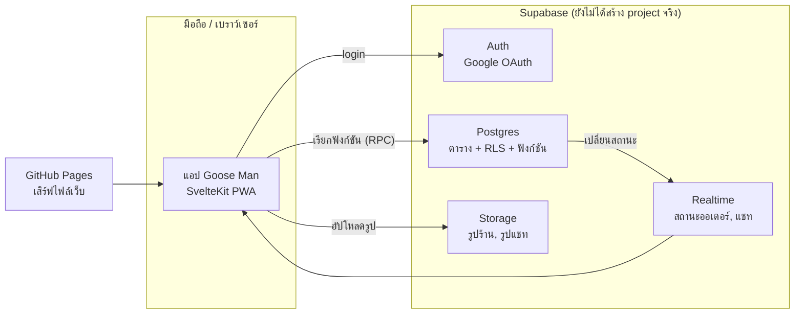
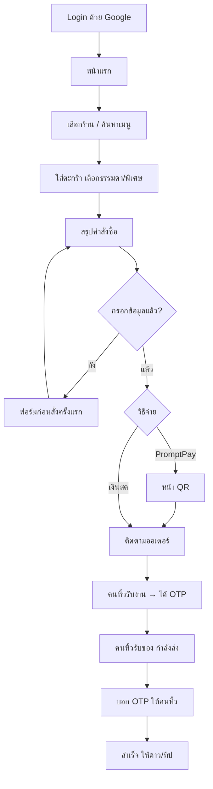
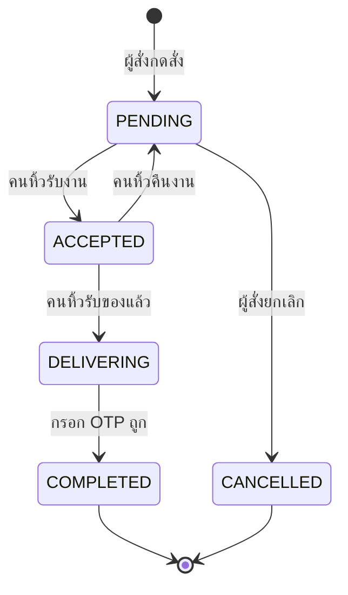

# คู่มือโปรเจกต์ Goose Man (ห่านบางมด)

> เอกสารหลักสำหรับทีม อ่านไฟล์นี้ไฟล์เดียวแล้วควรเข้าใจทั้งโปรเจกต์: แอปทำอะไร โค้ดอยู่ตรงไหน รันยังไง ทดสอบยังไง deploy ยังไง และงานไหนยังค้าง
>
> **อัปเดตล่าสุด:** 25 กันยายน 2569 · **branch หลัก:** `main`
>
> ถ้าแก้โค้ดส่วนไหนแล้วเนื้อหาในนี้ไม่ตรง ให้แก้ไฟล์นี้ใน commit เดียวกัน

---

## สารบัญ

1. [Goose Man คืออะไร](#1-goose-man-คืออะไร)
2. [สถานะตอนนี้](#2-สถานะตอนนี้)
3. [ภาพรวมระบบ](#3-ภาพรวมระบบ)
4. [เริ่มต้นสำหรับสมาชิกใหม่](#4-เริ่มต้นสำหรับสมาชิกใหม่)
5. [โครงสร้างโฟลเดอร์](#5-โครงสร้างโฟลเดอร์)
6. [Frontend (แอป)](#6-frontend-แอป)
7. [ผู้ใช้แต่ละแบบและลำดับการใช้งาน](#7-ผู้ใช้แต่ละแบบและลำดับการใช้งาน)
8. [ข้อมูลร้านค้าและเมนู](#8-ข้อมูลร้านค้าและเมนู)
9. [ราคาและโปรโมชัน](#9-ราคาและโปรโมชัน)
10. [ออเดอร์: สถานะ, OTP, แชท, รีวิว](#10-ออเดอร์-สถานะ-otp-แชท-รีวิว)
11. [ฐานข้อมูล (Supabase)](#11-ฐานข้อมูล-supabase)
12. [คนหิ้วและระบบจัดเส้นทาง](#12-คนหิ้วและระบบจัดเส้นทาง)
13. [โหมดเดโม](#13-โหมดเดโม)
14. [การทดสอบ](#14-การทดสอบ)
15. [Deploy และ Git](#15-deploy-และ-git)
16. [งานประจำของทีม (คู่มือทำเรื่องที่ทำบ่อย)](#16-งานประจำของทีม-คู่มือทำเรื่องที่ทำบ่อย)
17. [ความปลอดภัยและข้อมูลส่วนบุคคล](#17-ความปลอดภัยและข้อมูลส่วนบุคคล)
18. [กติกาการทำงานร่วมกัน](#18-กติกาการทำงานร่วมกัน)
19. [งานค้างและสิ่งที่ต้องตัดสินใจ](#19-งานค้างและสิ่งที่ต้องตัดสินใจ)
20. [ปัญหาที่เจอบ่อย](#20-ปัญหาที่เจอบ่อย)
21. [คำศัพท์](#21-คำศัพท์)

---

## 1. Goose Man คืออะไร

แพลตฟอร์ม **ฝากหิ้วอาหารแบบเพื่อนช่วยเพื่อน (P2P)** ภายใน มจธ. บางมด

- นักศึกษาสั่งอาหารจากร้านในโรงอาหาร แล้ว **เพื่อนนักศึกษาเป็นคนหิ้ว** ไปส่งถึงหน้าตึกเรียนหรือหอพัก
- แก้ปัญหาเดินตากแดดช่วงเที่ยงและคิวยาว คนหิ้วได้ค่าหิ้ว (15 บาทต่อออเดอร์ร้าน, 20 บาทต่อออเดอร์ฝากซื้อ)
- ใช้ได้เฉพาะบัญชี Google ของมหาวิทยาลัย `@kmutt.ac.th` และ `@mail.kmutt.ac.th` (ร้านค้า Partner ใช้อีเมลอื่นได้ถ้าทีมเชิญ)
- รับของด้วย **รหัส OTP 4 หลัก**: ผู้สั่งบอกรหัสให้คนหิ้วเมื่อได้ของครบเท่านั้น งานจึงปิดได้
- เป็น **เว็บแอปแบบติดตั้งลงมือถือได้ (PWA)** ออกแบบสำหรับมือถือเป็นหลัก ใช้บนคอมได้

**ชื่อและแบรนด์:** Goose Man / ห่านบางมด · มาสคอตคือห่านถือถุง · สีหลักส้ม มจธ. `#FA4616` · ฟอนต์ Prompt

**ระยะแรก (ตอนนี้):** เริ่มจากโรงอาหาร KFC (หลัก) 12 ร้าน และให้ **คนของทีมเราเป็นคนหิ้วก่อน** คนหิ้วต้องผ่านการ verify จากทีม ไม่มีปุ่มสมัครเป็นคนหิ้วเอง

---

## 2. สถานะตอนนี้

| ส่วน | สถานะ | หมายเหตุ |
|---|---|---|
| แอปฝั่งผู้สั่ง (สั่งอาหาร, ฝากซื้อ, ติดตาม, แชท, รีวิว) | **ใช้งานได้** | ทั้งโหมดเดโมและโหมดจริง |
| ร้านจริง 12 ร้านของโรงอาหาร KFC (หลัก) | **ใส่แล้ว** | 231 เมนู, 69 เมนูมีขนาดธรรมดา/พิเศษ |
| รูปเมนู | **ใช้รูป mockup** | รูปจาก Unsplash เลือกตามชื่อเมนู รอรูปจริงจากร้าน |
| รูปร้าน | **ใช้รูปจริง** | ตัดจาก PDF ร้านค้า |
| Login ด้วย Google + กรอกข้อมูลตอนสั่งครั้งแรก | **ใช้งานได้** | ไม่ต้องกรอกข้อมูลทันทีหลัง login |
| หน้าจัดการร้านสำหรับ Partner | **ใช้งานได้บางส่วน** | แบนเนอร์, คำโปรย, Fast lane, โปรโมชัน · ยังไม่มีปุ่มอัปโหลดโลโก้/รูปร้านในหน้าจอ (ฝั่งข้อมูลรองรับแล้ว) |
| โหมดคนหิ้ว (รับงาน, จัดเส้นทาง, ยืนยัน OTP) | **สร้างแล้ว แต่ซ่อนอยู่** | ไม่มีทางเข้าจากแอป รอออกแบบทางเข้าสำหรับคนหิ้วที่ verify แล้ว |
| ฐานข้อมูล Supabase (SQL ทั้งหมด) | **เขียนและทดสอบแล้ว** | **ยังไม่ได้สร้าง Supabase project จริง** แอปจึงยังรันด้วยข้อมูลเดโม |
| Deploy GitHub Pages | **ตั้งค่าแล้ว** | push เข้า `main` = build และ deploy อัตโนมัติ |
| PromptPay | **จำลอง** | QR เป็นภาพตัวอย่าง ยังไม่ได้ต่อระบบรับเงินจริง |
| พิกัดตึกในแคมปัส | **ค่าประมาณ** | ใช้คำนวณเส้นทางคนหิ้ว ต้องเก็บพิกัดจริง |
| backend Go/Fiber เดิม (`backend/`) | **เลิกใช้แล้ว** | เก็บไว้อ้างอิงเท่านั้น |

---

## 3. ภาพรวมระบบ



### 3.1 เทคโนโลยี

| ส่วน | ใช้อะไร | เวอร์ชัน |
|---|---|---|
| Framework | SvelteKit + Svelte 5 (runes) | kit ^2.63, svelte ^5.56 |
| Build | Vite | ^8 |
| CSS | Tailwind CSS v4 (token ใน `@theme`) | ^4.3 |
| ภาษา | TypeScript | ^6 |
| Backend | Supabase (Postgres, Auth, Realtime, Storage) | supabase-js ^2.117 |
| Deploy | `@sveltejs/adapter-static` → GitHub Pages | |
| Unit test | Vitest | ^5 |
| SQL test | PGlite (Postgres ที่รันใน Node ได้) | |
| Browser test | puppeteer-core + Chrome ในเครื่อง | |
| Node | 22 ขึ้นไป (CI ใช้ 22) | |

แอปเป็น **SPA เรนเดอร์ฝั่งเครื่องผู้ใช้ทั้งหมด** (`ssr = false`) ไม่มีเซิร์ฟเวอร์ของเราเอง ทุกกฎที่ต้องเชื่อถือได้ (ราคา, สิทธิ์, สถานะออเดอร์) อยู่ในฐานข้อมูล

### 3.2 สองโหมด: เดโม และ จริง

แอปเลือกโหมดเองจากไฟล์ `frontend/.env`

| | โหมดเดโม | โหมดจริง (live) |
|---|---|---|
| เงื่อนไข | ไม่ได้ใส่ `PUBLIC_SUPABASE_URL` / `PUBLIC_SUPABASE_ANON_KEY` | ใส่ครบทั้งสองค่า |
| ข้อมูลร้าน | จาก `frontend/src/lib/data/stores.ts` | จากตาราง `stores`, `menu_items` |
| Login | จำลอง (กดแล้วเข้าเป็นบัญชีทดลองทันที) | Google OAuth จริง |
| ออเดอร์ | เก็บในหน่วยความจำ + localStorage, มีตัวจับเวลาจำลองคนหิ้วรับงาน | สร้างผ่านฟังก์ชันในฐานข้อมูล, สถานะมาทาง Realtime |
| เหมาะกับ | พัฒนาหน้าจอ, สาธิต, ทดสอบ | ใช้งานจริง |

ตัวแปรที่ตัดสินคือ `isLive` ใน `frontend/src/lib/supabase.ts` โค้ดส่วนไหนต่างกันระหว่างสองโหมดจะมี `if (isLive)` แยกไว้ชัดเจน

---

## 4. เริ่มต้นสำหรับสมาชิกใหม่

### 4.1 สิ่งที่ต้องมี

- **Node.js 22+** ([nodejs.org](https://nodejs.org))
- **Git**
- **Google Chrome** (ใช้กับ browser test)
- VS Code + ส่วนขยาย Svelte (แนะนำ)
- Python 3 + `pip install ortools` (เฉพาะคนที่จะรัน benchmark เทียบ OR-Tools)

### 4.2 รันครั้งแรก

```sh
git clone https://github.com/Na1awut/goast_man.git
cd goast_man/frontend
npm install
npm run dev
```

เปิด <http://localhost:5173> จะเข้าโหมดเดโม กด **เข้าสู่ระบบด้วย Google** ได้เลย (ไม่ได้ต่อ Google จริง)

### 4.3 ต่อฐานข้อมูลจริง (เมื่อมี Supabase project แล้ว)

1. ทำตาม [`supabase/README.md`](supabase/README.md) เพื่อสร้าง project, รัน migration และเปิด Google login
2. คัดลอกไฟล์ตัวอย่าง:
   ```sh
   cd frontend
   cp .env.example .env
   ```
3. ใส่ค่าจาก Supabase → **Project Settings → API**:
   ```
   PUBLIC_SUPABASE_URL=https://<project-ref>.supabase.co
   PUBLIC_SUPABASE_ANON_KEY=<anon public key>
   ```
4. รัน `npm run dev` ใหม่

> **สำคัญ:** ใส่ได้เฉพาะ **anon (public) key** ห้ามใส่ `service_role` key ในแอปเด็ดขาด เพราะ key นั้นข้ามสิทธิ์ทุกอย่างในฐานข้อมูล `frontend/.env` ถูก gitignore ไว้แล้ว ไม่ขึ้น GitHub

### 4.4 คำสั่งที่ใช้บ่อย (รันใน `frontend/`)

| คำสั่ง | ทำอะไร |
|---|---|
| `npm run dev` | เปิดแอปโหมดพัฒนา (แก้โค้ดแล้วหน้าเว็บเปลี่ยนทันที) ที่พอร์ต 5173 |
| `npm run check` | ตรวจ TypeScript และ Svelte ทั้งโปรเจกต์ ต้องได้ 0 error |
| `npm test` | Unit test (Vitest) |
| `npm run test:sql` | รัน migration + seed บน PGlite แล้วทดสอบกฎในฐานข้อมูล |
| `npm run build` | build เว็บจริงลง `frontend/build/` |
| `npm run preview` | เปิดเว็บที่ build แล้ว ที่พอร์ต 4173 |
| `npm run test:e2e` | ทดสอบในเบราว์เซอร์จริง (ต้องเปิด `preview` ค้างไว้ก่อน) |

---

## 5. โครงสร้างโฟลเดอร์

```text
.
├── PROJECT_GUIDE.md            ← ไฟล์นี้
├── README.md                   ภาพรวมสั้นๆ
├── .github/workflows/deploy.yml   ทดสอบ + build + deploy ขึ้น GitHub Pages ทุกครั้งที่ push เข้า main
│
├── frontend/                   แอป (SvelteKit)
│   ├── .env.example            ตัวอย่างค่า Supabase (คัดลอกเป็น .env)
│   ├── package.json            คำสั่ง npm ทั้งหมด
│   ├── vite.config.ts          ตั้งค่า build, adapter-static, vitest
│   ├── static/                 ไฟล์ที่เสิร์ฟตรงๆ: ไอคอน, manifest.json (PWA), stores/*.webp (รูปร้าน)
│   ├── tests/
│   │   ├── sql.mjs             SQL test บน PGlite
│   │   ├── e2e.mjs             browser test ด้วย puppeteer
│   │   └── test-banner.png     รูปที่ใช้ทดสอบอัปโหลดแบนเนอร์
│   └── src/
│       ├── app.html            HTML หลัก (โหลดฟอนต์ Prompt / Inter)
│       ├── routes/
│       │   ├── +page.svelte    เปลือกแอป: เริ่มระบบ, สลับหน้าจอ, แถบเมนูล่าง, ป๊อปอัป, toast
│       │   ├── +layout.ts      ปิด SSR
│       │   └── layout.css      ธีมสี ฟอนต์ ขนาดแถบต่างๆ
│       └── lib/
│           ├── screens/        หน้าจอ 1 ไฟล์ต่อ 1 หน้า (ดูข้อ 6.2)
│           ├── components/     ชิ้นส่วน UI ที่ใช้ซ้ำ (ดูข้อ 6.3)
│           ├── stores/         state ของแอป (ดูข้อ 6.4)
│           ├── api/live.ts     ทุกการเรียก Supabase อยู่ไฟล์นี้ไฟล์เดียว
│           ├── supabase.ts     สร้าง client, ค่า isLive, แปลง error เป็นข้อความไทย
│           ├── data/
│           │   ├── stores.ts       ร้านและเมนูทั้งหมด (ต้นทางของ seed.sql)
│           │   ├── menuPhotos.ts   เลือกรูป mockup ให้เมนูตามชื่อ
│           │   ├── locations.ts    จุดส่งมอบ 8 จุด และจุดรับ 5 จุด
│           │   ├── riders.ts       คนหิ้วสมมติสำหรับโหมดเดโม
│           │   └── legal.ts        เงื่อนไขการใช้งาน, นโยบายความเป็นส่วนตัว, ติดต่อเรา
│           ├── routing/        ระบบจัดเส้นทางคนหิ้ว (ดูข้อ 12)
│           ├── pricing.ts      กฎราคา ค่าหิ้ว โค้ดส่วนลด โปรโมชัน
│           ├── profile.ts      กฎตรวจข้อมูลผู้ใช้, TERMS_VERSION
│           ├── feedback.ts     สั่นมือถือ (haptic)
│           ├── utils.ts        ฟังก์ชันเล็กๆ (formatBaht, isKmuttEmail, ...)
│           └── types/index.ts  type กลางของทั้งแอป
│
├── supabase/                   ฐานข้อมูล
│   ├── README.md               คู่มือตั้งค่า Supabase ทีละขั้น (ภาษาไทย)
│   ├── migrations/             ไฟล์ SQL เรียงตามวันที่ ต้องรันตามลำดับ (ดูข้อ 11.1)
│   ├── seed.sql                ข้อมูลร้านและเมนู (สร้างอัตโนมัติ ห้ามแก้มือ)
│   └── generate-seed.mjs       สร้าง seed.sql จาก frontend/src/lib/data/stores.ts
│
├── bench/routing/              วัดประสิทธิภาพระบบจัดเส้นทาง
│   ├── bench.ts                benchmark หลัก
│   ├── ortools_compare.py      เทียบผลกับ Google OR-Tools
│   ├── make_notebook.py        สร้าง notebook สำหรับ Colab
│   └── route_benchmark.ipynb   notebook ที่รันบน Colab
│
├── src/picture/                ไฟล์ต้นฉบับ (ไม่ได้ถูกใช้ในแอปโดยตรง)
│   ├── food_store/ร้านKFCหลัก.pdf   รูปและเมนูร้านจริงของโรงอาหาร KFC (หลัก)
│   ├── logo.jpg, goos_walk_1.jpg, goos_walk_2.jpg   มาสคอตและเฟรมห่านเดิน
│   └── banner.png, web_banner_1.png
├── picture/Mod_Pass_Pase-1.png UX mockup ต้นแบบของหน้าจอ
│
├── backend/                    (เลิกใช้) backend Go/Fiber เดิม
└── docker-compose.yml          (เลิกใช้) Postgres สำหรับ backend เดิม
```

---

## 6. Frontend (แอป)

### 6.1 การเปลี่ยนหน้าจอ

แอป **ไม่ได้ใช้ URL แยกหน้า** ทุกหน้าอยู่ใน `routes/+page.svelte` หน้าเดียว และสลับหน้าจอด้วย store `nav` (`lib/stores/nav.svelte.ts`)

- `nav.go('CHECKOUT')` ไปหน้าใหม่ (กดย้อนกลับได้)
- `nav.back()` ย้อนกลับ
- `nav.reset('HOME')` ล้างประวัติแล้วไปหน้านั้น (ใช้กับแถบเมนูล่าง หรือหลังสั่งเสร็จ)

แถบเมนูล่างแสดงเฉพาะหน้าหลัก (หน้าแรก, สั่งอาหาร, คำสั่งซื้อ, โปรไฟล์ และหน้าจัดการร้าน) หน้าที่มีปุ่มทำรายการด้านล่าง (เช่น สรุปคำสั่งซื้อ) จะซ่อนแถบเพื่อให้ปุ่มมีที่

**ด่านตรวจตอนเปิดแอป** (`+page.svelte`):
- ยังไม่ login → หน้า Login เสมอ
- บัญชีร้านค้า Partner ที่ยังไม่กรอกข้อมูลติดต่อ → บังคับหน้ากรอกข้อมูลทันที
- นักศึกษา → เข้าหน้าแรกได้เลย ข้อมูลจะถูกขอตอนสั่งครั้งแรก (ดูข้อ 6.6)

### 6.2 หน้าจอทั้งหมด (`lib/screens/`)

| หน้าจอ (Screen) | ไฟล์ | ทำอะไร |
|---|---|---|
| `LOGIN` | `LoginScreen.svelte` | ปุ่ม "เข้าสู่ระบบด้วย Google" (นักศึกษา) และ "เข้าสู่ระบบร้านค้า" (Partner), ลิงก์เงื่อนไข/นโยบาย |
| `ONBOARDING` | `OnboardingScreen.svelte` | ฟอร์มข้อมูลผู้ใช้ เปิดตอนสั่งครั้งแรก (นักศึกษา) หรือหลัง login (Partner) หรือเมื่อเงื่อนไขมีเวอร์ชันใหม่ |
| `HOME` | `HomeScreen.svelte` | ทักทาย, ปุ่ม "ฝากหิ้วเลย", เลือกจุดรับ (โรงอาหาร/เซเว่น/ซอย 45), จุดส่งที่ใช้บ่อย, สั่งซ้ำ, โปรร่วม, ดีล, ร้านในแอป, การแจ้งเตือน |
| `STORES` | `StoresScreen.svelte` | รายชื่อร้าน, ค้นหาชื่อร้านหรือเมนู, กรองตามโซน (แสดงเฉพาะโซนที่มีร้าน) |
| `STORE_DETAIL` | `StoreDetailScreen.svelte` | หน้าร้าน: รูป, โลโก้, คำโปรย, Fast lane, โปร, เมนูแยกหมวด, เลือกขนาดธรรมดา/พิเศษ, บันทึกร้านโปรด |
| `CUSTOM_ORDER` | `CustomOrderScreen.svelte` | ฝากซื้อของที่ไม่อยู่ในแอป (เช่น เซเว่น): พิมพ์รายการ + ราคาประมาณ, จ่ายเงินสดเท่านั้น, สูงสุด 1,000 บาท |
| `CHECKOUT` | `CheckoutScreen.svelte` | สรุปคำสั่งซื้อ: ข้อมูลผู้สั่ง (ผูกกับบัญชี), จุดส่ง, หมายเหตุ, รายการ, โค้ดส่วนลด, ยอดรวม, วิธีจ่ายเงิน |
| `PAYMENT` | `PaymentScreen.svelte` | QR PromptPay (จำลอง) นับถอยหลัง 10 นาที, แนบสลิป |
| `TRACKING` | `TrackingScreen.svelte` | ติดตามออเดอร์: ห่านเดินตามเส้นทาง, ข้อมูลคนหิ้ว, รหัส OTP (แตะเพื่อขยายเต็มจอ), ยกเลิกได้ตอนยังไม่มีคนรับ |
| `CHAT` | `ChatScreen.svelte` | แชทกับคนหิ้ว, ข้อความด่วน, ส่งรูป |
| `SUCCESS` | `SuccessScreen.svelte` | ส่งสำเร็จ: ให้ดาว, แท็กคำชม, ทิป +5 / +10 บาท |
| `ORDERS` | `OrdersScreen.svelte` | ประวัติออเดอร์ กรอง ทั้งหมด / กำลังดำเนินการ / สำเร็จ |
| `PROFILE` | `ProfileScreen.svelte` | ข้อมูลบัญชี, สถิติ, จุดรับเริ่มต้น, เงื่อนไข/นโยบาย/ติดต่อเรา, ออกจากระบบ |
| `EDIT_PROFILE` | `EditProfileScreen.svelte` | แก้ข้อมูลผู้ใช้ (ใช้ฟอร์มเดียวกับ ONBOARDING) |
| `PARTNER` | `PartnerScreen.svelte` | จัดการร้านของฉัน: แบนเนอร์, คำโปรย, Fast lane, สร้าง/แก้/ลบโปรโมชัน |
| `RIDER` | `RiderScreen.svelte` | โหมดคนหิ้ว (**ซ่อนอยู่ ไม่มีทางเข้า**): บอร์ดงาน, รอบที่ถือ, เส้นทางแนะนำ, รับของ, ยืนยัน OTP |

### 6.3 ชิ้นส่วน UI ที่ใช้ซ้ำ (`lib/components/`)

| Component | ใช้ทำอะไร |
|---|---|
| `AppBar` | แถบหัวหน้าจอ + ปุ่มย้อนกลับ |
| `BottomNav` | แถบเมนูล่าง (ปุ่มกลาง "สั่งอาหาร" มีตัวเลขจำนวนของในตะกร้า) |
| `BottomBar` | แถบปุ่มหลักติดด้านล่างของหน้าทำรายการ |
| `Sheet` | ป๊อปอัปเลื่อนขึ้นจากด้านล่าง |
| `Goose` | มาสคอตห่าน: ยืน, เดิน (สลับ 3 เฟรม), รอ, กระโดด · หยุดเคลื่อนไหวถ้าเครื่องตั้ง "ลดการเคลื่อนไหว" |
| `GooseMark` | โลโก้ Goose Man |
| `RouteStrip` | แถบเส้นทางร้าน → จุดส่ง พร้อมห่านเดินตามความคืบหน้า |
| `ProfileForm` | ฟอร์มข้อมูลผู้ใช้ (ใช้ทั้งกรอกครั้งแรกและแก้ไข กฎจึงไม่มีทางไม่ตรงกัน) |
| `QtyStepper` | ปุ่ม − จำนวน + |
| `StoreLogo` | โลโก้ร้าน ถ้าไม่มีจะใช้ตัวอักษรแรกของชื่อร้าน |
| `SmartImage` | รูปที่มีสถานะกำลังโหลด / โหลดไม่ได้ |
| `PartnerBadge` | ป้ายยืนยันร้าน Partner |
| `PromoLine` | บรรทัดแสดงโปรโมชัน |
| `StatusBadge` | ป้ายสถานะออเดอร์ |
| `LocationSheet` | ป๊อปอัปเลือกจุดส่ง |
| `NotificationSheet` | ป๊อปอัปการแจ้งเตือน |
| `LegalSheet` | ป๊อปอัปเงื่อนไข / นโยบาย / ติดต่อเรา |
| `MockQr` | QR PromptPay จำลอง |
| `ToastStack` | ข้อความแจ้งเตือนมุมบน |
| `Icon` | ไอคอนเส้น (SVG) ทั้งแอปใช้ตัวนี้ · **ห้ามใช้อีโมจิใน UI** (มี test ตรวจ) |
| `Avatar`, `AnimatedNumber`, `GoogleIcon` | รูปโปรไฟล์ตัวอักษร, ตัวเลขนับขึ้นลง, โลโก้ Google |

### 6.4 State ของแอป (`lib/stores/*.svelte.ts`)

ทุก store เป็น class ที่ใช้ Svelte 5 runes (`$state`, `$derived`) และ export เป็นตัวเดียวใช้ทั้งแอป

| Store | เก็บอะไร |
|---|---|
| `auth` | ผู้ใช้ปัจจุบัน, login/logout, `needsProfile` (ข้อมูลยังไม่ครบ), `mustOnboardNow` (Partner ต้องกรอกทันที), `displayName` |
| `nav` | หน้าจอปัจจุบันและประวัติย้อนกลับ |
| `catalog` | ร้านและเมนูทั้งหมด, การแก้หน้าร้านและโปรของ Partner |
| `cart` | ตะกร้า (ร้านเดียวต่อออเดอร์, แยกบรรทัดตามขนาดธรรมดา/พิเศษ), โค้ดส่วนลด, โปรที่ได้ · จำไว้ใน localStorage |
| `checkout` | จุดส่ง, หมายเหตุ, วิธีจ่าย, ยอดสุทธิ, `place()` สร้างออเดอร์ |
| `orders` | ออเดอร์ทั้งหมดของผู้ใช้, แชท, การแจ้งเตือน, ตัวจำลองคนหิ้วในโหมดเดโม, `customDraft` (ร่างฝากซื้อ) |
| `profileGate` | ด่านขอข้อมูลผู้ใช้ตอนสั่งครั้งแรก |
| `campus` | จุดส่งที่เลือกอยู่ |
| `storeView` | ร้านที่กำลังเปิดดู, ร้านโปรด |
| `rider` | บอร์ดงานและรอบของคนหิ้ว |
| `toast` | ข้อความแจ้งเตือนชั่วคราว |

### 6.5 การเรียกฐานข้อมูล

- **ทุก** การเรียก Supabase อยู่ใน `lib/api/live.ts` และแปลงแถวจากฐานข้อมูลเป็น type ของแอปในไฟล์เดียวกัน
- error จากฐานข้อมูลจะเป็นรหัส เช่น `ITEM_UNAVAILABLE` แล้ว `friendlyError()` ใน `lib/supabase.ts` แปลงเป็นข้อความไทยที่ผู้ใช้อ่านเข้าใจ (ตารางรหัสอยู่ข้อ 11.7)
- ถ้าเพิ่มรหัส error ใหม่ในฐานข้อมูล **ต้องเพิ่มข้อความไทยใน `friendlyError()` ด้วย**

### 6.6 ข้อมูลผู้ใช้และด่านสั่งครั้งแรก

**ข้อมูลที่ผูกกับบัญชี (กรอกครั้งเดียว):** ชื่อเล่น, ชั้นปี, คณะ/หน่วยงาน, รหัสนักศึกษา, เบอร์มือถือ, PromptPay (ไม่บังคับ), การยอมรับเงื่อนไข

**ข้อมูลที่เลือกใหม่ได้ทุกออเดอร์:** จุดส่ง, หมายเหตุถึงคนหิ้ว, วิธีจ่ายเงิน

ลำดับการทำงาน:
1. Login แล้วเข้าหน้าแรกทันที ดูร้านและใส่ตะกร้าได้
2. กดสั่ง (หรือส่งฝากซื้อ) ครั้งแรก → `profileGate.ensure()` เปิดฟอร์ม "ก่อนสั่งครั้งแรก"
3. กด "บันทึกแล้วไปต่อ" → กลับหน้าเดิม ตะกร้า/ข้อความที่พิมพ์ยังอยู่ครบ
4. หน้าสรุปคำสั่งซื้อแสดงข้อมูลผู้สั่งแบบอ่านอย่างเดียว "ผูกกับบัญชี" แก้ได้ที่หน้าโปรไฟล์

กฎตรวจข้อมูล (`lib/profile.ts` ตรงกับฟังก์ชัน `complete_profile` ในฐานข้อมูล):

| ช่อง | กฎ |
|---|---|
| ชื่อเล่น | 1-30 ตัวอักษร |
| เบอร์มือถือ | 10 หลัก ขึ้นต้น 06, 08, 09 |
| PromptPay | ไม่บังคับ · เบอร์มือถือ หรือเลขบัตรประชาชน 13 หลัก (ตรวจเลขท้าย) |
| ชั้นปี | ปี 1-5+, บัณฑิตศึกษา, บุคลากร |
| คณะ | เลือกจากรายการ หรือพิมพ์เอง · บุคลากรกรอกหน่วยงานแทน |
| รหัสนักศึกษา | ตัวเลข 8-13 หลัก (บุคลากรไม่ต้องกรอก) · 1 รหัสใช้ได้ 1 บัญชี |
| ยอมรับเงื่อนไข | ต้องติ๊ก · บันทึกเวอร์ชันและเวลาที่ยอมรับ |

ฐานข้อมูลตรวจซ้ำอีกชั้น: บัญชีที่ข้อมูลไม่ครบ **สร้างออเดอร์หรือรับงานไม่ได้** (`PROFILE_REQUIRED`) แม้จะเรียกระบบตรงโดยไม่ผ่านแอป

### 6.7 ระบบดีไซน์

- **สี** (อยู่ใน `src/routes/layout.css` → `@theme`)

  | Token | ค่า | ใช้กับ |
  |---|---|---|
  | `brand` | `#FA4616` (+ 50/100/200/300/600/700) | สีหลัก ปุ่ม ไฮไลต์ |
  | `beak` | `#F59E0B` | ดาวรีวิวเท่านั้น |
  | `fresh` | `#10B981` / `fresh-700` `#047857` | สำเร็จ, ประหยัด, ออนไลน์ |
  | `promptpay` | `#113767` | โลโก้ PromptPay เท่านั้น |
  | `canvas` | `#F5F5F7` | พื้นหลังหลังการ์ด |
- **ฟอนต์:** Prompt (ไทย) และ Inter (ละติน) จาก Google Fonts
- **ไอคอน:** ใช้ `Icon` component เท่านั้น ไม่ใช้อีโมจิ
- **ขนาด:** ออกแบบที่ความกว้างมือถือ 390px ขึ้นไป บนจอใหญ่แอปอยู่กลางจอกว้างสุด `max-w-md` (ยกเว้นหน้า login)
- **การเคลื่อนไหว:** เคารพค่า "ลดการเคลื่อนไหว" ของเครื่อง (`prefersReducedMotion()`)
- **PWA:** `static/manifest.json` ชื่อ "Goose Man", theme color `#FA4616`, แนวตั้ง

---

## 7. ผู้ใช้แต่ละแบบและลำดับการใช้งาน

| บทบาท | ใคร | ได้อะไร |
|---|---|---|
| `STUDENT` | นักศึกษา/บุคลากร มจธ. (อีเมล มจธ. เท่านั้น) | สั่งอาหาร, ฝากซื้อ, ติดตาม, แชท, รีวิว |
| คนหิ้ว | `STUDENT` ที่มีอีเมลอยู่ในตาราง `rider_roster` (ทีม verify แล้ว) | รับงาน, จัดเส้นทาง, ส่งของ (หน้าจอยังซ่อนอยู่) |
| `PARTNER` | เจ้าของร้านที่ทีมเชิญด้วยอีเมล | จัดการหน้าร้านและโปรโมชันของร้านตัวเอง |
| `ADMIN` | ทีม Goose Man | ตอนนี้ทำงานผ่าน SQL Editor ของ Supabase (ยังไม่มีหน้า admin) |

### 7.1 นักศึกษาสั่งอาหารจากร้าน



ข้อควรรู้:
- **1 ออเดอร์ = 1 ร้าน** ถ้าเพิ่มเมนูจากร้านอื่น ตะกร้าเดิมจะถูกล้างพร้อมแจ้งเตือน
- เมนูที่มีสองขนาดจะมีสองแถวในหน้าร้าน (ธรรมดา / พิเศษ) และเป็นคนละบรรทัดในตะกร้า
- ยกเลิกได้เฉพาะตอนสถานะ "กำลังหาเพื่อนรับหิ้ว"

### 7.2 ฝากซื้อ (Custom order)

สำหรับของที่ไม่อยู่ในแอป เช่น เซเว่นหน้าหอใน, ร้านซอยประชาอุทิศ 45 หรือโรงอาหารที่ยังไม่มีร้านในแอป
- พิมพ์รายการ (3-300 ตัวอักษร) และราคาประมาณ (1-1,000 บาท)
- ค่าหิ้ว 20 บาท, **จ่ายเงินสดเท่านั้น** เพราะคนหิ้วสำรองจ่ายก่อน
- ปุ่มจุดรับในหน้าแรกที่ไม่มีร้านในแอปจะขึ้นว่า "ฝากซื้อ" และพาไปหน้านี้

### 7.3 ร้านค้า Partner

1. ทีมเพิ่มอีเมลเจ้าของร้านใน `partner_invites` (ดูข้อ 16.2)
2. เจ้าของร้านกด "เข้าสู่ระบบร้านค้า" ด้วยอีเมลนั้น → กรอกข้อมูลติดต่อ → เข้าหน้า "จัดการร้านของฉัน"
3. แก้ได้: แบนเนอร์, คำโปรย (80 ตัวอักษร), Fast lane (1-60 นาที), โปรโมชัน
4. ร้าน Partner ได้: ป้ายยืนยัน, ขึ้นก่อนในรายการ, หน้าร้านสวยขึ้น, โปรโมชันของตัวเอง
5. เมนูและราคา **ยังแก้โดยทีมผ่านฐานข้อมูล** (ร้านแก้เองไม่ได้)

### 7.4 คนหิ้ว (ซ่อนอยู่ตอนนี้)

- ต้องอยู่ใน `rider_roster` ซึ่งทีมเพิ่มให้หลัง verify เท่านั้น
- ถือได้ไม่เกิน **4 งานต่อรอบ**, เริ่มส่งของแล้วรับงานใหม่ไม่ได้จนกว่าจะส่งครบ
- คืนงานได้ถ้ายังไม่ได้รับของ
- เห็นเบอร์และชื่อเล่นลูกค้าเฉพาะงานที่ถืออยู่
- ปิดงานด้วย OTP จากลูกค้า ผิด 5 ครั้งล็อกงาน
- **หน้าจอสร้างเสร็จแล้วแต่ไม่มีทางเข้า** ต้องตัดสินใจว่าคนหิ้วที่ verify แล้วจะเข้าทางไหน (ข้อ 19)

---

## 8. ข้อมูลร้านค้าและเมนู

### 8.1 ร้านในแอปตอนนี้: โรงอาหาร KFC (หลัก) 12 ร้าน

ข้อมูลจาก `src/picture/food_store/ร้านKFCหลัก.pdf`

| id | ร้าน | ประเภท | คิวโดยประมาณ (นาที) |
|---|---|---|---|
| `kfc-01` | ป้าวาบ (PA WAB FRESH MILK) | เครื่องดื่ม | 3 |
| `kfc-02` | ครัวกรุงศรี (KRUA KRUNGSRI) | ข้าวราดแกง ฮาลาล | 5 |
| `kfc-03` | NUY หนุ่ม บะหมี่เกี๊ยว | บะหมี่ ก๋วยเตี๋ยว | 7 |
| `kfc-04` | Dino Papa EXPRESS | ไก่ทอด ไอศกรีม | 5 |
| `kfc-05` | ร้านข้าวมันไก่ & ข้าวหมกไก่ (HALAL FOODS) | ข้าวมันไก่ ข้าวหมกไก่ ฮาลาล | 5 |
| `kfc-06` | ฟ้าใสแซ่บเว่อร์ | อาหารจานเดียว ของทานเล่น | 7 |
| `kfc-07` | ร้านตำลึงทอง อาหารตามสั่ง & ก๋วยเตี๋ยวไก่ | อาหารตามสั่ง ก๋วยเตี๋ยวไก่ | 10 |
| `kfc-08` | ครัวสุดารัตน์ (Krua Sudarat) | ข้าวราดแกง | 5 |
| `kfc-09` | ครัวคุณอู๋ BY COMCAMP | ข้าวราดแกง สุกี้ | 5 |
| `kfc-10` | จิรพันธุ์ เครื่องดื่ม | เครื่องดื่ม น้ำปั่น | 3 |
| `kfc-aroi` | อร่อยไม่ซ้ำ (ขนมปังปิ้ง & ลูกชิ้น) | ของว่าง ทานเล่น | 5 |
| `kfc-artter` | อาร์ทเตอร์ผลไม้สด-ปั่น | ผลไม้ น้ำผลไม้ปั่น | 4 |

- รวม **231 เมนู** มี **69 เมนู** ที่ขายสองขนาด (ธรรมดา/พิเศษ)
- รหัสเมนูคือ `<id ร้าน>-<ลำดับ>` เช่น `kfc-05-4` = ข้าวมันไก่ทอด (ธรรมดา 40 / พิเศษ 50)
- "คิวโดยประมาณ" เป็นค่าประมาณตามประเภทร้าน ใช้คำนวณเวลารอของคนหิ้ว ไม่ได้วัดจริง
- 8 ร้านมีหมายเหตุ "ร้านคิดค่าใส่กล่อง 5 บาท" ในคำอธิบายร้าน (ยังไม่ได้คิดในราคา รอตัดสินใจ ข้อ 19)

### 8.2 สิ่งที่ตั้งใจ **ไม่ใส่** เพราะไม่มีข้อมูลจริง

- **คะแนนและรีวิว:** ทุกร้านเริ่มเป็น "ร้านใหม่ในแอป" แอปจะแสดงดาวก็ต่อเมื่อมีรีวิวจริง
- **สถานะ Partner และโปรโมชัน:** ยังไม่มีร้านไหนสมัคร จึงไม่มีโปรปลอม
- **เบอร์โทรเจ้าของร้าน:** มีใน PDF แต่ไม่ใส่ เพราะเป็นข้อมูลส่วนตัว

> กติกาของทีม: **ห้ามแต่งข้อมูลร้านจริง** (คะแนน, รีวิว, โปร, สถานะ Partner) ถ้าไม่มีข้อมูลให้เว้นไว้

### 8.3 รูปภาพ

| รูป | ที่มา | อยู่ที่ |
|---|---|---|
| รูปร้าน | ตัดจาก PDF (ตัดเพดานบนออก) | `frontend/static/stores/<id ร้าน>.webp` |
| รูปเมนู | **mockup** จาก Unsplash เลือกตามชื่อเมนูและหมวด | `frontend/src/lib/data/menuPhotos.ts` |
| โลโก้ร้าน | ยังไม่มี แสดงตัวอักษรแรกของชื่อร้าน | Partner อัปโหลดเองได้ในอนาคต |

รูปเมนูเป็นแค่ภาพประกอบประเภทอาหาร **ไม่ใช่อาหารจริงของร้าน** กติกาเลือกรูปจะดูชื่อเมนูก่อน โดยจับชื่อจานก่อนวัตถุดิบ เช่น "ก๋วยเตี๋ยวลูกชิ้น" ได้รูปก๋วยเตี๋ยว ไม่ใช่ลูกชิ้น และหมวดเครื่องดื่มจะลองรูปเครื่องดื่มก่อน เมื่อได้รูปจริงให้ใส่ `imageUrl` ของเมนูนั้นแทน

### 8.4 แก้ร้านหรือเมนู

1. แก้ `frontend/src/lib/data/stores.ts` (ใช้ helper `stall()` และ `menu()`)
2. สร้าง seed ใหม่:
   ```sh
   node supabase/generate-seed.mjs
   ```
3. รัน `npm run test:sql` และ `npm test` ใน `frontend/`
4. ถ้าใช้ฐานข้อมูลจริงแล้ว ต้องอัปเดตข้อมูลในฐานข้อมูลด้วย (รัน SQL ใหม่ หรือแก้ในตาราง)

> **ห้ามแก้ `supabase/seed.sql` ด้วยมือ** ไฟล์นี้สร้างจาก `stores.ts` ทุกครั้ง

### 8.5 จุดรับและจุดส่ง (`data/locations.ts`)

**จุดรับ (Pickup hubs):** โรงอาหาร KFC (หลัก), โรงอาหารพระจอมเกล้า (โรงชาย), โรงอาหาร 190 ปี (Green Canteen), เซเว่นหน้าหอใน, ร้านอาหารซอยประชาอุทิศ 45
ตอนนี้มีร้านในแอปเฉพาะ KFC (หลัก) จุดอื่นเป็นแบบฝากซื้อ

**จุดส่ง (Drop-off):** อาคาร LX ชั้น 1 หน้าตู้เต่าบิน, อาคารเรียนรวม CB2, CB3, อาคาร SIT ชั้น 1, ตึกวิศวะ 12 ชั้น, หอสมุด มจธ., หอพักชาย S5, หอพักหญิง S6

---

## 9. ราคาและโปรโมชัน

กฎอยู่ใน `frontend/src/lib/pricing.ts` และ **ฐานข้อมูลคิดซ้ำเองใน `place_order`** ยอดจากแอปเป็นแค่ตัวอย่าง ยอดจริงคือยอดที่ฐานข้อมูลคำนวณ

### 9.1 ค่าต่างๆ

| รายการ | ค่า |
|---|---|
| ค่าหิ้ว ออเดอร์ร้าน | 15 บาท |
| ค่าหิ้ว ฝากซื้อ | 20 บาท |
| ราคาฝากซื้อสูงสุด | 1,000 บาท |
| จำนวนต่อเมนู | 1-50 |
| ทิปหลังส่งสำเร็จ | 0-100 บาท (ในแอปมีปุ่ม +5, +10) |

### 9.2 โค้ดส่วนลด

| โค้ด | ผล | เงื่อนไข |
|---|---|---|
| `KMUTTFIRST` | ลด 15 บาท | เฉพาะออเดอร์แรกของบัญชี (ไม่นับออเดอร์ที่ยกเลิก) |
| `GOOSEFREE` | ฟรีค่าหิ้ว | ไม่ลดซ้ำถ้าโปรร้านฟรีค่าหิ้วให้แล้ว |

### 9.3 โปรโมชันของร้าน

| ชนิด | ความหมาย | ขึ้นแอปเมื่อไร |
|---|---|---|
| `DEAL` | โปรของร้านเอง | ทันทีที่บันทึก |
| `CO_PROMO` | โปรร่วมกับ Goose Man (ขึ้นหน้าแรกด้วย) | หลังทีมอนุมัติ · ถ้าร้านแก้เงื่อนไขภายหลัง จะกลับไปรออนุมัติใหม่ |

โปรมีได้: ลดเงิน, ฟรีค่าหิ้ว, จำนวนขั้นต่ำ, วันหมดอายุ
**ใช้ได้ 1 โปรต่อออเดอร์** ระบบเลือกโปรที่ประหยัดที่สุดให้เอง (ไม่ซ้อนกัน)

### 9.4 สูตรยอดสุทธิ

```
ยอดสุทธิ = max(0, ค่าอาหาร + ค่าหิ้ว − ส่วนลดจากโค้ด − ส่วนลดจากโปรร้าน)
```

ตัวอย่าง: ข้าวมันไก่ทอด ธรรมดา 40 + พิเศษ 50 = 90, ค่าหิ้ว 15, ใช้ `GOOSEFREE` → 90 + 15 − 15 = **90 บาท**

---

## 10. ออเดอร์: สถานะ, OTP, แชท, รีวิว

### 10.1 สถานะ



| สถานะ | ข้อความในแอป |
|---|---|
| `PENDING` | กำลังหาเพื่อนรับหิ้ว |
| `ACCEPTED` | เพื่อนรับงานแล้ว กำลังต่อคิวซื้อ |
| `DELIVERING` | กำลังเดินมาส่ง |
| `COMPLETED` | ส่งสำเร็จ |
| `CANCELLED` | ยกเลิกแล้ว |

- รหัสออเดอร์รูปแบบ `#KM-xxxx`
- ทุกครั้งที่สถานะเปลี่ยน ระบบเพิ่มข้อความ SYSTEM ในแชทของออเดอร์นั้นอัตโนมัติ

### 10.2 OTP

- รหัส 4 หลัก สุ่มตอนสร้างออเดอร์ เก็บในตาราง `order_secrets` ที่แอปอ่านตรงไม่ได้
- ผู้สั่งเห็นรหัสเฉพาะตอนสถานะ `ACCEPTED` และ `DELIVERING` (ผ่านฟังก์ชัน `my_orders`)
- คนหิ้วกรอกผิดครบ 5 ครั้ง งานถูกล็อก (`OTP_LOCKED`) ต้องให้ทีมช่วย
- แตะรหัสในหน้าติดตามเพื่อขยายเต็มจอให้คนหิ้วดู

### 10.3 แชท

- เห็นได้เฉพาะผู้สั่งกับคนหิ้วของออเดอร์นั้น
- มีข้อความด่วน: "ถึงจุดนัดแล้วครับ", "รออยู่หน้าตู้เต่าบินครับ", "มาถึงรึยังครับ?", "ขอบคุณครับ"
- ส่งรูปได้ รูปเก็บใน bucket ส่วนตัว `chat-images` และเปิดดูผ่านลิงก์ชั่วคราว 1 ชั่วโมง

### 10.4 รีวิวและทิป

หลังส่งสำเร็จ ให้ดาว 1-5, แท็กคำชม (ส่งไวมาก, อาหารยังร้อน, พูดจาสุภาพ, ตรงเวลา) และทิป +5 / +10 บาท ให้ได้เฉพาะออเดอร์ที่สำเร็จแล้ว

---

## 11. ฐานข้อมูล (Supabase)

คู่มือตั้งค่าทีละขั้นอยู่ที่ [`supabase/README.md`](supabase/README.md) ส่วนนี้อธิบายว่ามีอะไรอยู่ในนั้น

### 11.1 Migrations (ต้องรันตามลำดับ)

| ลำดับ | ไฟล์ | เพิ่มอะไร |
|---|---|---|
| 1 | `20260924000000_init.sql` | ตารางหลัก, RLS, ฟังก์ชันสั่ง/รับงาน/OTP, Realtime, Storage |
| 2 | `20260925000000_profile_onboarding.sql` | ข้อมูลผู้ใช้ (ชั้นปี, การยอมรับเงื่อนไข), `complete_profile` |
| 3 | `20260926000000_riders.sql` | `rider_roster`, จำกัด 4 งาน, คืนงาน, `rider_board` |
| 4 | `20260927000000_store_images.sql` | โลโก้และรูปร้านที่ Partner ตั้งเอง |
| 5 | `20260928000000_kfc_menu_sizes.sql` | โซน `kfc-main`, ราคาพิเศษ, บรรทัดออเดอร์แยกขนาด · **ต้องกด Run แยกก่อน seed** |
| 6 | `20260929000000_profile_at_first_order.sql` | ต้องมีข้อมูลผู้ใช้ครบก่อนสั่งหรือรับงาน |
| 7 | `seed.sql` | ร้านและเมนู |

> **ถ้าจะแก้ฐานข้อมูล ให้สร้าง migration ใหม่เสมอ** (ตั้งชื่อด้วยวันที่ถัดไป) ห้ามแก้ไฟล์ที่รันไปแล้ว และเพิ่มชื่อไฟล์ใน `frontend/tests/sql.mjs`, ตารางนี้ และ `supabase/README.md`

### 11.2 ตาราง

| ตาราง | เก็บอะไร | ใครอ่านได้ |
|---|---|---|
| `stores` | ร้าน: ชื่อ, โซน, รูป, โลโก้, แบนเนอร์, คำโปรย, Fast lane, เจ้าของ | ทุกคน (รวมคนไม่ login) |
| `menu_items` | เมนู: ราคา, ราคาพิเศษ, หมวด, มีขาย/หมด | ทุกคน |
| `promotions` | โปรโมชันของร้าน | ทุกคนเห็นโปรที่ใช้งานได้ · เจ้าของร้านเห็นของตัวเองทั้งหมด |
| `profiles` | ข้อมูลผู้ใช้ + role + ร้านที่ดูแล | เจ้าของบัญชีเท่านั้น · แก้ผ่าน `complete_profile` เท่านั้น |
| `partner_invites` | อีเมลเจ้าของร้านที่ทีมเชิญ | ไม่มีใคร (ทีมใช้ SQL Editor) |
| `rider_roster` | อีเมลคนหิ้วที่ verify แล้ว | ไม่มีใคร (ทีมใช้ SQL Editor) |
| `orders` | ออเดอร์ | ผู้สั่งและคนหิ้วของออเดอร์นั้น · คนหิ้วเห็นงานที่ยังไม่มีคนรับ |
| `order_items` | รายการในออเดอร์ (แยกตามขนาด) | เหมือน `orders` |
| `order_secrets` | OTP และจำนวนครั้งที่กรอกผิด | ไม่มีใคร (อ่านผ่านฟังก์ชันเท่านั้น) |
| `chat_messages` | แชทของออเดอร์ | ผู้สั่งและคนหิ้วของออเดอร์นั้น |

### 11.3 ฟังก์ชัน (RPC) ที่แอปเรียก

**หลักการ:** แอป **ไม่เขียนตารางออเดอร์ตรงๆ** ทุกการเปลี่ยนแปลงต้องผ่านฟังก์ชัน `SECURITY DEFINER` ที่ตรวจทุกครั้งว่าใครเป็นคนเรียก

| ฟังก์ชัน | ใครเรียก | ทำอะไร |
|---|---|---|
| `complete_profile` | ผู้ใช้ | บันทึก/แก้ข้อมูลผู้ใช้ ตรวจรูปแบบและรหัสนักศึกษาซ้ำ |
| `place_order` | ผู้สั่ง | สร้างออเดอร์ร้าน คิดราคาจากฐานข้อมูล เลือกโปรที่ดีที่สุด ตรวจโค้ด |
| `place_custom_order` | ผู้สั่ง | สร้างออเดอร์ฝากซื้อ |
| `cancel_order` | ผู้สั่ง | ยกเลิก (เฉพาะ `PENDING`) |
| `rate_order` | ผู้สั่ง | ให้ดาว แท็ก ทิป (เฉพาะ `COMPLETED`) |
| `my_orders` | ผู้สั่ง | ออเดอร์ทั้งหมด + รายการ + ข้อมูลคนหิ้ว + OTP (เมื่อถึงเวลา) ในครั้งเดียว |
| `rider_board` | คนหิ้ว | งานที่รอคนรับ + งานที่ถืออยู่ (พร้อมเบอร์ลูกค้า) + ความจุ |
| `accept_order` | คนหิ้ว | รับงาน (ตรวจรายชื่อ, ความจุ 4, กดพร้อมกันได้คนเดียว) |
| `release_order` | คนหิ้ว | คืนงานก่อนรับของ |
| `mark_delivering` | คนหิ้ว | รับของแล้ว กำลังส่ง |
| `confirm_delivery` | คนหิ้ว | ปิดงานด้วย OTP |
| `update_storefront` | Partner | แก้คำโปรย, แบนเนอร์, Fast lane, โลโก้, รูปร้าน (รูปต้องอยู่ในโฟลเดอร์ร้านตัวเอง) |
| `is_rider`, `rider_capacity` | ภายใน/แอป | ตรวจว่าเป็นคนหิ้วหรือไม่, ความจุต่อรอบ (4) |

โปรโมชันของ Partner เขียนตาราง `promotions` ตรงได้ (มี RLS จำกัดเฉพาะร้านตัวเอง และ trigger กันการอนุมัติโปรร่วมเอง)

### 11.4 Trigger สำคัญ

| Trigger | ทำอะไร |
|---|---|
| `on_auth_user_created` | ตอนสมัคร: ปฏิเสธอีเมลที่ไม่ใช่ มจธ. (ยกเว้นมีคำเชิญ Partner), สร้าง profile, ผูกร้านให้ Partner |
| `orders_status_log` | เพิ่มข้อความ SYSTEM ในแชทเมื่อสถานะเปลี่ยน |
| `promotions_guard` | Partner อนุมัติโปรร่วมเองไม่ได้ · แก้เงื่อนไขโปรร่วมแล้วกลับไปรออนุมัติ |
| `orders_require_ready_profile` | ข้อมูลผู้ใช้ไม่ครบ สั่งหรือรับงานไม่ได้ |

### 11.5 Storage

| Bucket | สาธารณะ? | ใช้กับ | กติกา |
|---|---|---|---|
| `store-banners` | ใช่ | แบนเนอร์, โลโก้, รูปร้าน | Partner เขียนได้เฉพาะโฟลเดอร์ `<id ร้าน>/` ของตัวเอง |
| `chat-images` | ไม่ | รูปในแชท | อ่าน/เขียนได้เฉพาะคนในออเดอร์ · เปิดผ่านลิงก์ชั่วคราว |

### 11.6 Realtime

ตาราง `orders`, `chat_messages`, `promotions` ส่งการเปลี่ยนแปลงถึงแอปทันที (ติดตามสถานะ, แชท, โปรใหม่)

### 11.7 รหัส error และข้อความในแอป

| รหัส | ข้อความที่ผู้ใช้เห็น |
|---|---|
| `AUTH_REQUIRED` | กรุณาเข้าสู่ระบบก่อน |
| `KMUTT_ONLY` | (ตอนสมัคร) ใช้ได้เฉพาะอีเมล มจธ. |
| `PROFILE_REQUIRED` | กรอกข้อมูลผู้ใช้ (ชื่อเล่น เบอร์ คณะ) ก่อน แล้วลองอีกครั้ง |
| `STORE_UNAVAILABLE` | ร้านนี้ปิดรับออเดอร์อยู่ตอนนี้ |
| `ITEM_UNAVAILABLE` | มีเมนูในตะกร้าที่หมดแล้ว ลองเอาออกแล้วสั่งใหม่ |
| `EMPTY_CART` | ตะกร้ายังว่างอยู่ |
| `PROMO_INVALID` / `PROMO_NOT_ELIGIBLE` | โค้ดนี้ใช้ไม่ได้ / ใช้ได้เฉพาะออเดอร์แรก |
| `CANNOT_CANCEL` / `CANNOT_RATE` | ยกเลิกไม่ได้แล้ว / ให้คะแนนได้เมื่อส่งสำเร็จเท่านั้น |
| `BAD_PHONE`, `BAD_PROMPTPAY`, `BAD_STUDENT_ID`, `BAD_NICKNAME`, `BAD_FACULTY`, `BAD_STUDY_LEVEL` | ข้อมูลช่องนั้นไม่ถูกต้อง |
| `STUDENT_ID_TAKEN` | รหัสนักศึกษานี้ถูกใช้กับบัญชีอื่นแล้ว |
| `CONSENT_REQUIRED` | ต้องยอมรับเงื่อนไขก่อนใช้งาน |
| `PARTNER_ONLY` | บัญชีนี้ไม่มีสิทธิ์จัดการร้าน |
| `BAD_IMAGE` | รูปต้องอัปโหลดผ่านแอปเท่านั้น |
| `RIDER_ONLY` | บัญชีนี้ยังไม่ได้อยู่ในรายชื่อคนหิ้ว |
| `RIDER_FULL` | รอบนี้ถือครบ 4 งานแล้ว |
| `FINISH_ROUND_FIRST` | เริ่มส่งของแล้ว ส่งรอบนี้ให้ครบก่อน |
| `ALREADY_TAKEN` | มีเพื่อนรับงานนี้ไปแล้ว |
| `BAD_STATE` | สถานะงานเปลี่ยนไปแล้ว ลองรีเฟรช |
| `OTP_LOCKED` | ใส่รหัสผิดครบ 5 ครั้ง งานถูกล็อก |

---

## 12. คนหิ้วและระบบจัดเส้นทาง

### 12.1 ระบบจัดเส้นทาง (`frontend/src/lib/routing/`)

พอร์ตมาจากตัวแก้ปัญหา OR-Tools (PDPTW) ของโปรเจกต์ route optimize เดิม ให้เป็น TypeScript ที่รันในมือถือได้

**หน้าที่:**
1. **`planRoute` / `planRound`:** จัดลำดับจุดรับ-ส่งของงานที่คนหิ้วถืออยู่ให้เดินน้อยที่สุด
2. **`suggestAddOns`:** แนะนำงานที่ "ทางเดียวกัน" ที่รับเพิ่มได้ (เพิ่มเวลาไม่เกิน 5 นาที, แสดงสูงสุด 3 งาน) ถ้ายังไม่ถืองานเลย จะแนะนำงานที่ใกล้ที่สุด

**เงื่อนไขที่บังคับ:**
- ต้องรับของก่อนส่งของของออเดอร์เดียวกัน
- ถือได้ไม่เกิน 4 งานต่อรอบ
- ไปถึงร้านก่อนอาหารเสร็จต้องรอ (เวลาเสร็จ = เวลาสั่ง + คิวร้าน)
- ต้องส่งทันเวลาที่สัญญา (40 นาทีหลังสั่ง) ถ้าเป็นไปไม่ได้ ยังให้เส้นทางที่เดินสั้นที่สุด
- เริ่มส่งของแล้ว ปิดรอบ ไม่รับของเพิ่ม

**วิธีคิด:** ลองทุกลำดับที่เป็นไปได้ (exhaustive search) คำตอบจึงดีที่สุดเสมอ จำกัดสูงสุด 6 งานต่อการคำนวณ

**โมเดลเวลาเดิน (`cost.ts`):**

```
เวลา = (ระยะเส้นตรง × 1.3) / 1.3 m/s + 25 วินาที × (ชั้นปลายทาง − 1)
```

| ค่า | ความหมาย |
|---|---|
| `speedMps` 1.3 | ความเร็วเดิน เมตร/วินาที |
| `detourFactor` 1.3 | ทางเดินจริงยาวกว่าเส้นตรง 30% |
| `floorPenaltyS` 25 | เวลาขึ้นลิฟต์/บันไดต่อชั้น |
| `slowdown` 1 | ตัวคูณสภาพอากาศ (ฝนตกหนักราว 1.4) |

> **พิกัดทุกจุดใน `places.ts` เป็นค่าประมาณ (`approximate: true`) ยังไม่ได้วัดจริง** เส้นทางแนะนำจะแม่นเท่าพิกัด วิธีแก้: Google Maps → คลิกขวาที่ทางเข้าตึก → คัดลอก lat, lng → ใส่แทน แล้วลบ `approximate`

### 12.2 ผล benchmark (รันบน Google Colab)

**A. เวลาคำนวณเส้นทาง** (สุ่ม 300 ครั้งต่อขนาด, ความจุ 6, เวลาส่ง 40 นาที)

| จำนวนงาน | median | p95 | หาเส้นทางที่ทันเวลาได้ |
|---|---|---|---|
| 1 | 0.007 ms | 0.035 ms | 300/300 |
| 2 | 0.019 ms | 0.057 ms | 300/300 |
| 3 | 0.040 ms | 0.163 ms | 299/300 |
| 4 | 0.679 ms | 0.953 ms | 286/300 |
| 5 | 17.4 ms | 30.1 ms | 246/300 |
| 6 | 428 ms | 1,331 ms | 64/100 |

**B. เวลาแนะนำงานทางเดียวกัน** (คนหิ้วถือ 2 งาน): 10 งานเปิด 0.39 ms, 50 งาน 1.9 ms, 100 งาน 3.6 ms, 200 งาน 7.0 ms

**C. เทียบกับ Google OR-Tools** (ให้ OR-Tools คิด 1 วินาทีต่อโจทย์, 30 โจทย์ต่อขนาด)

| จำนวนงาน | ของเรายาวกว่า OR-Tools | OR-Tools หาไม่เจองานที่เราเจอ | ของเรา median | OR-Tools median |
|---|---|---|---|---|
| 2-5 | 0 ครั้ง (ต่าง 0.00%) | 0 | 0.004-15 ms | ~1,000 ms |
| 6 | 0 ครั้ง | 4 | 488 ms | ~1,000 ms |

**สรุป:** เส้นทางดีเท่า OR-Tools ทุกโจทย์และเร็วกว่ามาก จึงตั้ง **ความจุไว้ที่ 4 งานต่อรอบ** (คำนวณไม่ถึง 1 ms) เพราะที่ 5-6 งานเริ่มช้าและส่งทันเวลาน้อยลง

การรันซ้ำ:
```sh
node --experimental-strip-types bench/routing/bench.ts          # เต็ม (หนัก ควรรันบน Colab)
node --experimental-strip-types bench/routing/bench.ts --quick  # แบบเร็ว
python bench/routing/ortools_compare.py                          # ต้อง pip install ortools
```
หรือเปิด `bench/routing/route_benchmark.ipynb` บน Google Colab (แนะนำ เพราะเครื่องในทีมบางเครื่อง RAM น้อย)

### 12.3 คนหิ้วในฐานข้อมูล

- `is_rider()` = อีเมลอยู่ใน `rider_roster` และเป็น `STUDENT`
- ทุกการตรวจคนหิ้วผ่านฟังก์ชันนี้ตัวเดียว ถ้าวันหนึ่งจะเปิดให้นักศึกษาทุกคนหิ้ว แก้ฟังก์ชันเดียว (ดู `supabase/README.md`) แต่ **นโยบายตอนนี้คือต้อง verify ก่อน**
- เอาคนหิ้วออกจากรายชื่อ: งานที่ถืออยู่ยังส่งต่อจนจบได้ แต่รับงานใหม่ไม่ได้

---

## 13. โหมดเดโม

| เรื่อง | พฤติกรรม |
|---|---|
| บัญชีนักศึกษาทดลอง | `goose.b@mail.kmutt.ac.th` "กูส บางมด" เริ่มแบบยังไม่มีข้อมูล (จะเจอฟอร์มตอนสั่งครั้งแรก) |
| บัญชีร้านทดลอง | `demo.shop@example.com` "บัญชีร้านทดลอง" ผูกกับร้าน `kfc-05` ร้านนี้จะเป็น Partner เฉพาะในเบราว์เซอร์นั้นตอนบัญชีนี้ login อยู่ |
| คนหิ้วรับงาน | 3 วินาทีหลังสั่ง |
| เริ่มส่งของ | 8 วินาทีหลังสั่ง |
| คนหิ้วตอบแชท | 2 วินาที |
| ปิดงาน | ปุ่ม "[เดโม] จำลอง: คนหิ้วกรอก OTP สำเร็จ" ในหน้าติดตาม (ไม่แสดงในโหมดจริง) |
| โปรร่วม | อนุมัติอัตโนมัติหลังไม่กี่วินาที |
| ประวัติตัวอย่าง | มีออเดอร์เก่าจากร้าน `kfc-05` ให้ลองปุ่ม "สั่งซ้ำ" |
| งานคนหิ้วตัวอย่าง | 5 งาน (OTP คือ `1234`) ใช้ในหน้าคนหิ้วที่ซ่อนอยู่ |
| การจำข้อมูล | เก็บใน localStorage ของเบราว์เซอร์ ล้างได้ด้วยการออกจากระบบหรือล้างข้อมูลเว็บ |

ในโหมดจริง ปุ่มจำลองและตัวเลข "เพื่อนออนไลน์" ถูกซ่อน เพราะไม่มีข้อมูลจริงรองรับ

---

## 14. การทดสอบ

### 14.1 มี 4 แบบ

| แบบ | คำสั่ง (ใน `frontend/`) | ตรวจอะไร | จำนวน |
|---|---|---|---|
| Type check | `npm run check` | TypeScript + Svelte ทั้งโปรเจกต์ | ต้อง 0 error |
| Unit | `npm test` | ระบบจัดเส้นทาง, แปลงงานเป็นเส้นทาง, รูป mockup ของเมนู | 24 test |
| SQL | `npm run test:sql` | รัน migration ทุกไฟล์ + seed บน PGlite แล้วลองกฎทั้งหมด: ราคา, โปร, ขนาดพิเศษ, สิทธิ์, สถานะออเดอร์, OTP, คนหิ้ว, ข้อมูลผู้ใช้, รูป | 101 ข้อ |
| Browser (e2e) | `npm run test:e2e` | กดใช้แอปจริงใน Chrome ตั้งแต่ login ถึงส่งสำเร็จ, ฝากซื้อ, โปรไฟล์, Partner | 69 ข้อ |

**ก่อน push ทุกครั้ง ควรผ่านครบทั้ง 4 แบบ** (CI บน GitHub รันแค่ `npm test` และ build)

### 14.2 วิธีรัน browser test

```sh
cd frontend
npm run build
npm run preview          # เปิดค้างไว้ในอีกหน้าต่าง (พอร์ต 4173)
npm run test:e2e         # หรือ node tests/e2e.mjs <โฟลเดอร์> เพื่อเก็บภาพหน้าจอทุกขั้น
```

| ตัวแปร | ค่าเริ่มต้น | ใช้เมื่อ |
|---|---|---|
| `CHROME_PATH` | `C:/Program Files/Google/Chrome/Application/chrome.exe` | Chrome อยู่ที่อื่น หรือใช้ Mac/Linux |
| `E2E_URL` | `http://localhost:4173/` | เปิด preview พอร์ตอื่น |

ข้อควรรู้:
- **build ใหม่แล้วต้องปิดและเปิด `npm run preview` ใหม่** ไม่อย่างนั้นจะได้หน้าเก่า และ test จะพังแบบงงๆ
- test ตั้งเบราว์เซอร์เป็น "เคลื่อนไหวปกติ" เอง เพราะ Windows ที่ปิด Animation effects จะทำให้ห่านไม่เดิน
- ผลลัพธ์บรรทัด `FAIL` คือข้อที่ไม่ผ่าน ท้ายสุดมีสรุป `X passed, Y failed` และ `CONSOLE ERRORS`

### 14.3 เมื่อเพิ่มฟีเจอร์

- กฎราคาหรือสิทธิ์ใหม่ → เพิ่มใน `tests/sql.mjs`
- หน้าจอหรือลำดับการใช้งานใหม่ → เพิ่มใน `tests/e2e.mjs`
- ฟังก์ชันคำนวณล้วน → เพิ่มไฟล์ `*.test.ts` ข้างไฟล์นั้นใน `src/`

---

## 15. Deploy และ Git

### 15.1 GitHub Pages

`.github/workflows/deploy.yml` ทำงานทุกครั้งที่ push เข้า `main`: `npm ci` → `npm test` → `npm run build` → deploy

> **push เข้า `main` = เว็บจริงเปลี่ยนทันที** ตรวจให้ผ่านทุก test ก่อน push

ตั้งค่าครั้งเดียว (ละเอียดใน `frontend/README.md` หัวข้อ Deploy):
1. Settings → Pages → Source: **GitHub Actions**
2. โหมดจริง: Settings → Secrets and variables → Actions → Secrets: `PUBLIC_SUPABASE_URL`, `PUBLIC_SUPABASE_ANON_KEY` (ไม่ใส่ = เว็บเป็นโหมดเดโม)
3. โดเมนของตัวเอง: ตั้ง DNS แล้วใส่ Variable `CUSTOM_DOMAIN` (ไม่ใส่ = เว็บอยู่ที่ `https://<user>.github.io/<repo>/`)
4. เพิ่ม URL เว็บใน Supabase → Authentication → URL Configuration → Redirect URLs ไม่อย่างนั้น Google login จะกลับเข้าแอปไม่ได้

### 15.2 Repository

โปรเจกต์มี 2 repo ที่เก็บโค้ดชุดเดียวกัน:

| ชื่อ remote | URL |
|---|---|
| `origin` | https://github.com/Na1awut/goast_man |
| `beta` | https://github.com/mrbee1140-byte/Goose-Man---Beta- |

push ให้ครบทั้งสองที่:
```sh
git push origin main
git push beta main
```

### 15.3 ไฟล์ที่ห้ามขึ้น GitHub

- `frontend/.env` (มี key ของ Supabase) ถูก gitignore แล้ว
- `node_modules/`, `frontend/build/`, `frontend/.svelte-kit/`
- `bench/routing/instances.json` (สร้างจาก benchmark)

---

## 16. งานประจำของทีม (คู่มือทำเรื่องที่ทำบ่อย)

ทุกคำสั่ง SQL รันใน Supabase → **SQL Editor**

### 16.1 เพิ่ม / เอาคนหิ้วออก (หลัง verify แล้ว)

```sql
-- เพิ่ม (ใช้อีเมล มจธ. ที่เขาใช้ login)
insert into rider_roster (email, note) values ('somchai.k@mail.kmutt.ac.th', 'ทีมงาน verify แล้ว 25/09/69');

-- ดูรายชื่อ
select * from rider_roster order by added_at;

-- เอาออก
delete from rider_roster where email = 'somchai.k@mail.kmutt.ac.th';
```

### 16.2 เชิญร้าน Partner

```sql
insert into partner_invites (email, store_id) values ('owner@gmail.com', 'kfc-05');
```
เจ้าของร้านกด "เข้าสู่ระบบร้านค้า" ด้วยอีเมลนั้น ระบบผูกบัญชีกับร้านให้เอง

### 16.3 อนุมัติโปรร่วม

```sql
-- ดูที่รออนุมัติ
select p.id, s.name, p.title, p.discount, p.free_delivery, p.min_qty
from promotions p join stores s on s.id = p.store_id
where p.kind = 'CO_PROMO' and not p.approved;

-- อนุมัติ
update promotions set approved = true where id = '<promotion-id>';
```

### 16.4 เปิด/ปิดร้าน หรือเมนูหมด

```sql
update stores set is_open = false where id = 'kfc-07';          -- ปิดร้าน
update menu_items set is_available = false where id = 'kfc-04-8'; -- เมนูหมด
```

### 16.5 แก้เงื่อนไขการใช้งานหรือนโยบายความเป็นส่วนตัว

1. แก้ข้อความใน `frontend/src/lib/data/legal.ts`
2. เปลี่ยน `TERMS_VERSION` ใน `frontend/src/lib/profile.ts` (ตอนนี้ `'2026-09'`)
3. ผู้ใช้ทุกคนจะถูกขอให้ยอมรับใหม่

### 16.6 เปลี่ยนค่าหิ้ว

ต้องแก้ **2 ที่ให้ตรงกัน**:
- `frontend/src/lib/pricing.ts` → `STORE_DELIVERY_FEE`, `CUSTOM_DELIVERY_FEE`
- ฐานข้อมูล: migration ใหม่ที่ `create or replace` ฟังก์ชัน `store_delivery_fee()` / `custom_delivery_fee()`

แล้วแก้ตัวเลขที่เกี่ยวข้องใน `tests/sql.mjs` และ `tests/e2e.mjs`

### 16.7 เพิ่มโรงอาหารใหม่

1. เพิ่มค่าใน enum `store_zone` (migration ใหม่ ต้องรันแยกก่อนใช้)
2. เพิ่มใน `StoreZone` (`types/index.ts`), `STORE_ZONES`, `ZONE_NAMES` (`data/stores.ts`)
3. เพิ่มจุดรับใน `PICKUP_HUBS` (`data/locations.ts`) และพิกัดใน `routing/places.ts`
4. เพิ่มร้านใน `STORE_CATALOGUE` แล้ว `node supabase/generate-seed.mjs`

---

## 17. ความปลอดภัยและข้อมูลส่วนบุคคล

- **Key:** แอปใช้แค่ anon key ซึ่งปลอดภัยที่จะอยู่ในเว็บ เพราะสิทธิ์ทั้งหมดคุมด้วย RLS และฟังก์ชัน **ห้าม** ใช้ `service_role` key ในแอปหรือ commit ขึ้น GitHub
- **ตรวจก่อน commit:** อย่าให้มี key, รหัสผ่าน หรือไฟล์ `.env` ติดไป
- **ราคา:** เชื่อเฉพาะที่ฐานข้อมูลคำนวณ
- **อีเมล มจธ. เท่านั้น:** บังคับที่ฐานข้อมูลตอนสมัคร แก้โค้ดแอปก็ข้ามไม่ได้
- **PDPA:** ผู้ใช้ต้องยอมรับเงื่อนไขและนโยบายก่อนให้ข้อมูล ระบบบันทึกเวอร์ชันและเวลาที่ยอมรับ
- **ข้อมูลที่คนอื่นเห็น:** รหัสนักศึกษาไม่แสดงให้ใคร · คนหิ้วเห็นชื่อเล่นและเบอร์ลูกค้าเฉพาะงานที่ถืออยู่ · ลูกค้าเห็นชื่อ คณะ ชั้นปี เบอร์ของคนหิ้วที่รับงาน
- **ข้อมูลจริงของคนอื่น:** ห้ามใส่เบอร์โทรหรือข้อมูลส่วนตัวของคนจริงในโค้ด ข้อมูลตัวอย่าง และ test (ใช้เบอร์สมมติ)
- **ข้อมูลร้าน:** ห้ามแต่งคะแนน รีวิว โปร หรือสถานะ Partner ให้ร้านจริง
- **ข้อมูลประมาณ:** ค่าที่ยังไม่ได้วัดจริง (พิกัด, คิวร้าน) ต้องมีหมายเหตุบอกว่าเป็นค่าประมาณ

---

## 18. กติกาการทำงานร่วมกัน

1. **commit งานที่เสร็จก่อนเริ่มงานใหม่ทุกครั้ง** จะได้ย้อนกลับทีละเรื่องได้
2. **1 commit = 1 เรื่อง** ข้อความ commit บอกว่าเปลี่ยนอะไรและทำไม
3. **ผ่าน test ครบก่อน push** (ข้อ 14) เพราะ push เข้า `main` = deploy
4. **push ทั้ง `origin` และ `beta`**
5. **เปลี่ยนฐานข้อมูลด้วย migration ใหม่เท่านั้น** ห้ามแก้ไฟล์ที่รันไปแล้ว
6. **กฎที่ต้องเชื่อถือได้ต้องอยู่ในฐานข้อมูล** แอปตรวจซ้ำได้เพื่อให้ผู้ใช้เห็นผลเร็ว แต่ตัวตัดสินคือฐานข้อมูล
7. **งานหนัก (benchmark) รันบน Google Colab** เครื่องบางเครื่องในทีม RAM น้อย
8. **ข้อความในแอปเป็นภาษาไทย** สุภาพ สั้น ไม่ใช้อีโมจิ
9. **แก้เอกสารให้ตรงกับโค้ด** ใน commit เดียวกัน (ไฟล์นี้, `supabase/README.md`, `frontend/README.md`)

---

## 19. งานค้างและสิ่งที่ต้องตัดสินใจ

### ต้องตัดสินใจ

| เรื่อง | ตัวเลือก |
|---|---|
| **ค่ากล่อง 5 บาท** (8 ร้าน) | บวกรวมในราคาเมนูเลย หรือ แยกเป็นบรรทัด "ค่ากล่อง" ในสรุปคำสั่งซื้อ |
| **ทางเข้าโหมดคนหิ้ว** สำหรับคนที่ verify แล้ว | ปุ่มที่ขึ้นเฉพาะคนในรายชื่อ หรือ แยกเป็นแอป/ลิงก์ของคนหิ้ว |
| **ขั้นตอน verify คนหิ้ว** | ต้องตรวจอะไรบ้าง (บัตร นศ., สัมภาษณ์, อบรม) และใครเป็นคนเพิ่มรายชื่อ |

### ต้องทำ

| งาน | รายละเอียด |
|---|---|
| สร้าง Supabase project จริง | ทำตาม `supabase/README.md` แล้วใส่ key ใน `.env` และ GitHub Secrets |
| เก็บพิกัดตึกจริง | แก้ `frontend/src/lib/routing/places.ts` ให้ตรงทางเข้าจริง ลบ `approximate` |
| รูปอาหารจริง | ขอรูปจากร้าน แทนรูป mockup |
| ปุ่มอัปโหลดโลโก้/รูปร้านในหน้า Partner | ฝั่งข้อมูล (`catalog`, `api/live.ts`, ฐานข้อมูล) รองรับแล้ว เหลือหน้าจอ |
| PromptPay จริง | ต่อระบบรับชำระเงินจริงแทน QR จำลอง |
| จำนวนคนหิ้วที่ออนไลน์ | ยังไม่มีข้อมูล (ซ่อนในโหมดจริง) |
| หน้า admin | ตอนนี้ทีมทำงานผ่าน SQL Editor |
| ร้านในโรงอาหารอื่น | โรงชาย, Green Canteen ยังเป็นแบบฝากซื้อ |
| แผนที่ในแอป | ยังไม่มี |

---

## 20. ปัญหาที่เจอบ่อย

| อาการ | สาเหตุ / วิธีแก้ |
|---|---|
| `npm run dev` ขึ้น error parse ไฟล์ หลัง `git pull` | ยังมี merge conflict ค้างในไฟล์ (มีเครื่องหมาย `<<<<<<<`) แก้ conflict ก่อน แล้ว `npm install` |
| build/test ขึ้น "out of memory" / "memory allocation failed" | RAM เต็ม (Windows commit limit) ปิดโปรแกรมอื่น หรือเพิ่ม page file · benchmark ให้รันบน Colab · vitest ตั้ง `pool: 'threads'` ไว้แล้ว |
| browser test พังแบบหาปุ่มไม่เจอ หลัง build ใหม่ | ปิด `npm run preview` แล้วเปิดใหม่ |
| browser test: ห่านไม่เดิน | เครื่องปิด Animation effects (test จัดการให้แล้ว) ถ้าเปิดแอปเองจะเห็นห่านนิ่ง เป็นพฤติกรรมที่ถูกต้อง |
| Google login แล้วกลับเข้าแอปไม่ได้ | ยังไม่ได้เพิ่ม URL เว็บใน Supabase → Redirect URLs |
| login ด้วยอีเมลอื่นไม่ได้ | ตั้งใจ: รับเฉพาะอีเมล มจธ. (ร้านค้าต้องได้คำเชิญ) |
| รัน `seed.sql` แล้ว error เรื่อง `kfc-main` | ต้องรัน migration `20260928...kfc_menu_sizes.sql` แยกให้เสร็จก่อน |
| สั่งไม่ได้ ขึ้น "กรอกข้อมูลผู้ใช้ก่อน" | ข้อมูลผู้ใช้ยังไม่ครบ ให้กรอกที่หน้าโปรไฟล์ → แก้ไข |
| push ไม่ได้ (403) | บัญชี GitHub ยังไม่มีสิทธิ์ใน repo นั้น ขอเจ้าของ repo เพิ่มเป็น collaborator |
| เว็บบน GitHub Pages เป็นโหมดเดโม | ยังไม่ได้ใส่ Secrets `PUBLIC_SUPABASE_URL` / `PUBLIC_SUPABASE_ANON_KEY` |

---

## 21. คำศัพท์

| คำ | ความหมาย |
|---|---|
| ฝากหิ้ว / หิ้ว | ให้เพื่อนซื้อและถือของมาส่ง |
| คนหิ้ว (Rider) | นักศึกษาที่รับงานไปซื้อและส่ง |
| ผู้สั่ง (Buyer / Customer) | นักศึกษาที่สั่ง |
| ฝากซื้อ (Custom order) | สั่งของที่ไม่อยู่ในแอป พิมพ์รายการเอง |
| ร้าน Partner | ร้านที่เข้าร่วมกับ Goose Man มีหน้าจัดการร้าน |
| โปรร่วม (CO_PROMO) | โปรที่ร้านทำร่วมกับ Goose Man ต้องให้ทีมอนุมัติ |
| Fast lane | เวลาทำอาหารสำหรับออเดอร์จากแอป (ร้านทำให้ก่อน) |
| รอบ (Round / Outing) | การออกไปรับ-ส่งหนึ่งครั้งของคนหิ้ว ถือได้สูงสุด 4 งาน |
| OTP | รหัส 4 หลักที่ผู้สั่งบอกคนหิ้วเพื่อปิดงาน |
| โหมดเดโม / โหมดจริง | ไม่ต่อ / ต่อ Supabase (ข้อ 3.2) |
| RLS (Row-Level Security) | กฎในฐานข้อมูลว่าใครอ่าน/เขียนแถวไหนได้ |
| RPC | ฟังก์ชันในฐานข้อมูลที่แอปเรียกใช้ |
| Migration | ไฟล์ SQL ที่เปลี่ยนโครงสร้างฐานข้อมูล รันตามลำดับ |
| Seed | ข้อมูลตั้งต้น (ร้านและเมนู) |
| anon key | key สาธารณะของ Supabase ใส่ในแอปได้ |
| service_role key | key สิทธิ์เต็มของ Supabase **ห้ามใส่ในแอป** |
| PWA | เว็บที่ติดตั้งเป็นแอปบนมือถือได้ |
| PDPTW | โจทย์จัดเส้นทางรับ-ส่งที่มีกรอบเวลา (ที่มาของระบบจัดเส้นทาง) |
